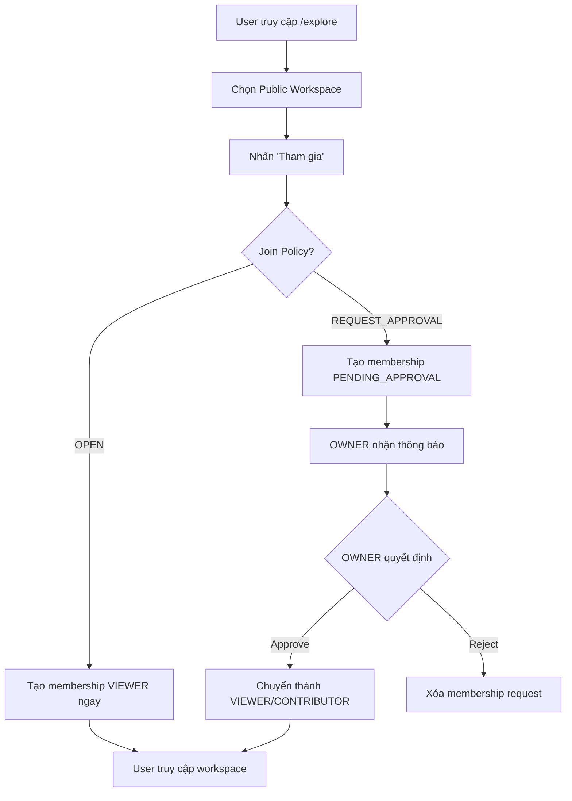
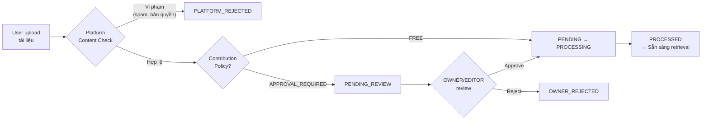
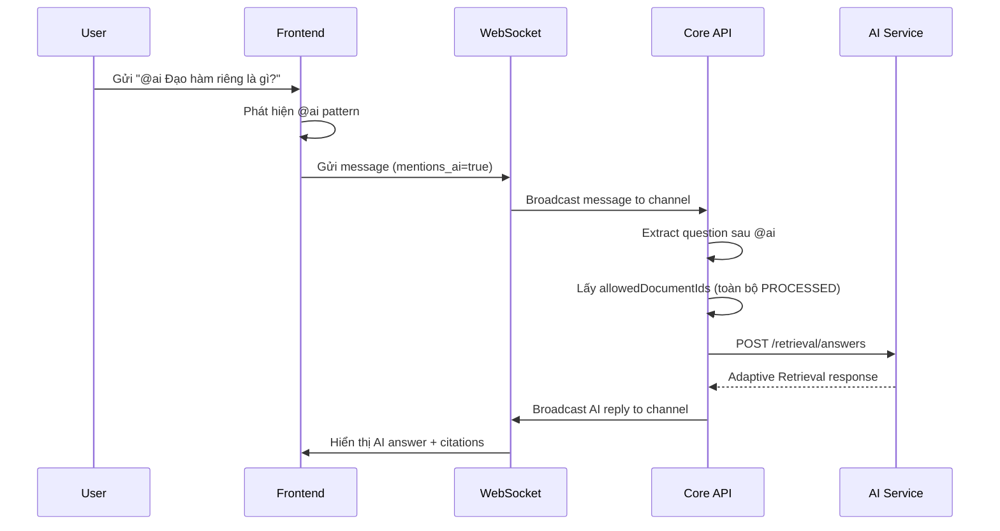
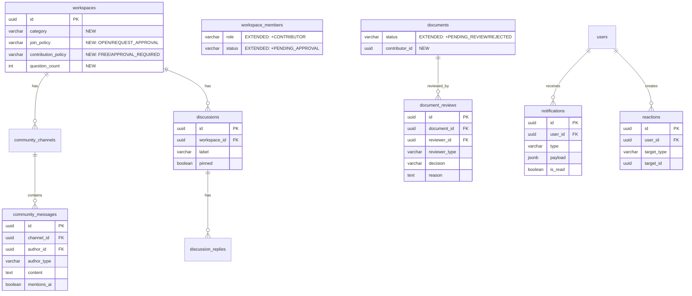
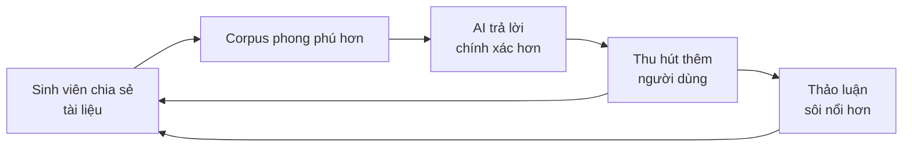
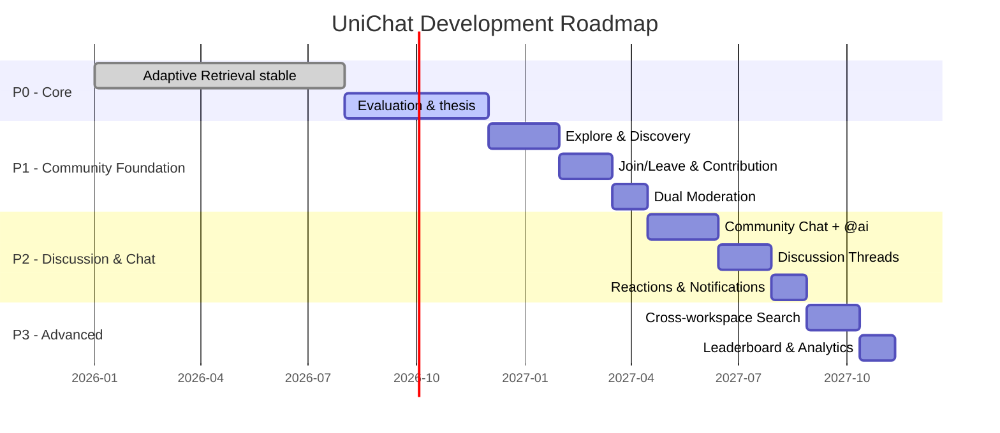

# Hướng phát triển mở rộng: Community Workspace — UniChat

> Tài liệu này được viết dưới dạng **hướng phát triển trong khóa luận** — trình bày tầm nhìn, thiết kế chi tiết và roadmap mở rộng hệ thống UniChat thành nền tảng cộng đồng tri thức AI.

---

## 1. Bối cảnh và động lực

UniChat P0 triển khai **Adaptive Knowledge Retrieval & Reasoning** — cho phép người dùng upload tài liệu vào Workspace và hỏi AI dựa trên nguồn tri thức đó. Hệ thống đã hỗ trợ ba mức visibility (`PRIVATE`, `SHARED`, `PUBLIC`) và phân quyền đa vai trò (`OWNER`, `EDITOR`, `VIEWER`).

Tuy nhiên, Workspace hiện tại vẫn mang tính **cá nhân hoặc nhóm nhỏ** — chưa có cơ chế để cộng đồng rộng hơn cùng đóng góp tri thức và tương tác. Trong bối cảnh giáo dục đại học, nhu cầu chia sẻ tài liệu, thảo luận và học tập cộng đồng là rất lớn.

### Tầm nhìn

Mở rộng Workspace PUBLIC thành **Community Workspace** — không gian cộng đồng nơi sinh viên, giảng viên và nhà nghiên cứu có thể:

- **Chia sẻ tài liệu** vào kho tri thức chung
- **Thảo luận** qua hệ thống chat cộng đồng real-time
- **Hỏi AI** dựa trên toàn bộ tài liệu cộng đồng đóng góp
- **Khám phá** các workspace tri thức công khai theo chủ đề

```
┌─────────────────────────────────────────────────────────────────┐
│                    UniChat P0 (hiện tại)                        │
│  ┌──────────┐  ┌──────────┐  ┌──────────┐                     │
│  │ PRIVATE  │  │ SHARED   │  │ PUBLIC   │                     │
│  │ 1 owner  │  │ Nhóm nhỏ │  │ Đọc/Hỏi │                     │
│  └──────────┘  └──────────┘  └──────────┘                     │
└─────────────────────────────────────────────────────────────────┘
                          ▼
┌─────────────────────────────────────────────────────────────────┐
│              UniChat Community (hướng phát triển)               │
│  ┌──────────┐  ┌──────────┐  ┌──────────────────────────────┐  │
│  │ PRIVATE  │  │ SHARED   │  │ COMMUNITY WORKSPACE         │  │
│  │ Cá nhân  │  │ Nhóm     │  │ • Tự do tham gia            │  │
│  └──────────┘  └──────────┘  │ • Đóng góp tài liệu         │  │
│                              │ • Chat cộng đồng + @ai       │  │
│                              │ • Thảo luận theo chủ đề      │  │
│                              │ • Kiểm duyệt song song      │  │
│                              └──────────────────────────────┘  │
└─────────────────────────────────────────────────────────────────┘
```

---

## 2. Các quyết định thiết kế đã xác nhận

| # | Quyết định | Lựa chọn | Lý do |
|---|---|---|---|
| D1 | **Phạm vi** | Hướng phát triển trong khóa luận, không triển khai trong P0 | P0 cần stable trước; community là contribution có giá trị cho phần mở rộng |
| D2 | **Join policy** | PUBLIC → tự do tham gia; PRIVATE → không vào được | Giảm friction cho cộng đồng mở; privacy bảo đảm cho workspace riêng |
| D3 | **Contribution model** | **Tùy chọn khi tạo workspace**: tự do upload hoặc cần OWNER approve | Linh hoạt — workspace học thuật nghiêm túc cần kiểm duyệt, nhóm bạn bè thì tự do |
| D4 | **Chat & AI** | Chat riêng (1:1 với AI) + Chat cộng đồng (dùng `@ai` để gọi AI) | Tách biệt rõ: cá nhân khám phá vs. cộng đồng thảo luận |
| D5 | **Moderation** | Song song — OWNER kiểm duyệt trong workspace + Platform kiểm duyệt trước khi cho upload | Bảo vệ hai lớp: chất lượng nội dung (OWNER) + an toàn nền tảng (platform) |
| D6 | **Anonymity** | **Không** cho phép ẩn danh | Môi trường giáo dục cần trách nhiệm, tên thật tăng chất lượng thảo luận |

---

## 3. Thiết kế chi tiết theo Phase

### Phase 1: Community Foundation

> Nền tảng cộng đồng cơ bản — Explore, Join, Contribute.

---

#### 3.1 Explore & Discovery

**Trang `/explore`** — điểm vào cho cộng đồng:

```
┌──────────────────────────────────────────────────────────────────┐
│ 🔍 Tìm kiếm workspace...        [Lọc theo danh mục ▾]          │
├──────────────────────────────────────────────────────────────────┤
│                                                                  │
│  📊 Trending         🆕 Mới nhất         ⭐ Phổ biến             │
│                                                                  │
│  ┌─────────────────┐  ┌─────────────────┐  ┌─────────────────┐  │
│  │ 📚 Giải tích 1  │  │ 🧪 Hóa hữu cơ  │  │ 💻 CTDL & GT   │  │
│  │ Khoa Toán-Tin   │  │ Khoa Hóa        │  │ IT Club         │  │
│  │ 📄 45 tài liệu  │  │ 📄 32 tài liệu  │  │ 📄 78 tài liệu  │  │
│  │ 👥 120 thành viên│  │ 👥 85 thành viên │  │ 👥 200 thành viên│  │
│  │ 💬 350 câu hỏi  │  │ 💬 180 câu hỏi  │  │ 💬 520 câu hỏi  │  │
│  │                 │  │                 │  │                 │  │
│  │ [Tham gia]      │  │ [Tham gia]      │  │ [Đã tham gia ✓] │  │
│  └─────────────────┘  └─────────────────┘  └─────────────────┘  │
│                                                                  │
│  [Xem thêm...]                                                   │
└──────────────────────────────────────────────────────────────────┘
```

**API mới:**

| Method | Route | Mô tả | Auth |
|---|---|---|---|
| GET | `/api/v1/explore/workspaces` | Danh sách PUBLIC workspace, filter/sort/search | Authenticated |
| GET | `/api/v1/explore/categories` | Danh sách category | Authenticated |
| POST | `/api/v1/workspaces/{id}/join` | Tham gia workspace | Authenticated |
| DELETE | `/api/v1/workspaces/{id}/leave` | Rời workspace | Authenticated (non-OWNER) |

**Data model mở rộng:**

```sql
-- Thêm fields vào bảng workspaces
ALTER TABLE workspaces ADD COLUMN category VARCHAR(50);
ALTER TABLE workspaces ADD COLUMN join_policy VARCHAR(20) 
    DEFAULT 'OPEN' CHECK (join_policy IN ('OPEN', 'REQUEST_APPROVAL'));
ALTER TABLE workspaces ADD COLUMN contribution_policy VARCHAR(20) 
    DEFAULT 'APPROVAL_REQUIRED' CHECK (contribution_policy IN ('FREE', 'APPROVAL_REQUIRED'));
ALTER TABLE workspaces ADD COLUMN question_count INTEGER DEFAULT 0;

-- Bảng category master
CREATE TABLE workspace_categories (
    code VARCHAR(50) PRIMARY KEY,
    display_name VARCHAR(100) NOT NULL,
    icon VARCHAR(10),
    sort_order INTEGER NOT NULL DEFAULT 0
);
```

---

#### 3.2 Community Membership & Join Flow

**Luồng tham gia workspace:**



**Permission matrix mở rộng cho Community:**

| Hành động | OWNER | EDITOR | CONTRIBUTOR | VIEWER | PUBLIC_AUTH (chưa join) |
|---|:---:|:---:|:---:|:---:|:---:|
| Xem tài liệu & hỏi AI riêng | ✅ | ✅ | ✅ | ✅ | ✅ |
| Chat cộng đồng | ✅ | ✅ | ✅ | ✅ | ❌ |
| Đề xuất/Upload tài liệu | ✅ | ✅ | ✅* | ❌ | ❌ |
| Approve/Reject tài liệu | ✅ | ✅ | ❌ | ❌ | ❌ |
| Quản lý thành viên | ✅ | ❌ | ❌ | ❌ | ❌ |
| Cài đặt workspace | ✅ | ✅** | ❌ | ❌ | ❌ |

> \* CONTRIBUTOR upload tùy `contribution_policy`: nếu `FREE` thì upload thẳng; nếu `APPROVAL_REQUIRED` thì vào hàng chờ duyệt.
> \** EDITOR chỉ sửa name/description, không sửa visibility/policy.

---

#### 3.3 Document Contribution & Dual Moderation

**Quy trình kiểm duyệt song song:**



**Platform Content Check (tầng 1):**
- Kiểm tra file type, size, malware scan
- Kiểm tra nội dung cơ bản (từ khóa nhạy cảm, spam pattern)
- Trùng lặp: SHA-256 hash check với tài liệu đã có trong workspace
- Chạy tự động trước khi chuyển cho OWNER review

**OWNER/EDITOR Review (tầng 2):**
- Xem metadata, preview nội dung
- Approve → trigger ingestion pipeline (RabbitMQ)
- Reject → ghi lý do, thông báo contributor

**Data model mở rộng:**

```sql
-- Mở rộng document status
-- Thêm: PENDING_REVIEW, PLATFORM_REJECTED, OWNER_REJECTED
ALTER TABLE documents ADD COLUMN contributor_id UUID REFERENCES users(id);

-- Bảng review history
CREATE TABLE document_reviews (
    id UUID PRIMARY KEY DEFAULT gen_random_uuid(),
    document_id UUID NOT NULL REFERENCES documents(id) ON DELETE CASCADE,
    reviewer_id UUID NOT NULL REFERENCES users(id),
    reviewer_type VARCHAR(20) NOT NULL CHECK (reviewer_type IN ('PLATFORM', 'OWNER', 'EDITOR')),
    decision VARCHAR(20) NOT NULL CHECK (decision IN ('APPROVED', 'REJECTED')),
    reason TEXT,
    reviewed_at TIMESTAMPTZ NOT NULL DEFAULT NOW()
);
CREATE INDEX idx_doc_reviews_document ON document_reviews(document_id, reviewed_at DESC);
```

---

### Phase 2: Discussion & Community Chat

> Thêm tương tác cộng đồng real-time, biến workspace thành cộng đồng sống.

---

#### 3.4 Community Chat với @ai

**Hai kênh chat song song:**

```
┌──────────────────────────────────────────────────────────────────┐
│  [💬 Chat riêng]  [👥 Chat cộng đồng]                           │
├──────────────────────────────────────────────────────────────────┤
│                                                                  │
│  👤 Nguyễn Văn A                                    10:30        │
│  Mọi người ơi, ai giải thích giúp mình khái niệm              │
│  đạo hàm riêng trong chương 3 được không?                      │
│                                                                  │
│  👤 Trần Thị B                                      10:32        │
│  Bạn thử hỏi AI xem, tài liệu chương 3 có giải thích rõ      │
│                                                                  │
│  👤 Nguyễn Văn A                                    10:33        │
│  @ai Đạo hàm riêng là gì? Giải thích dựa trên tài liệu       │
│  chương 3 Giải tích nhiều biến                                  │
│                                                                  │
│  🤖 UniChat AI                                      10:33        │
│  Đạo hàm riêng của hàm f(x,y) theo biến x là...              │
│  Theo [1] Giải tích nhiều biến, trang 45:                      │
│  "Đạo hàm riêng đo lường tốc độ thay đổi..."                 │
│  📎 [1] giai-tich-nhieu-bien.pdf — Trang 45 (0.89)            │
│                                                                  │
│  👍 3  👤 Trần Thị B: Hay quá, cảm ơn AI!                     │
│                                                                  │
├──────────────────────────────────────────────────────────────────┤
│  Nhập tin nhắn... (@ai để hỏi AI)              [Gửi]            │
└──────────────────────────────────────────────────────────────────┘
```

**Cơ chế @ai:**

| Aspect | Chat riêng (hiện có) | Chat cộng đồng (mới) |
|---|---|---|
| Đối tượng | 1 user ↔ AI | Nhiều user + AI khi được gọi |
| Trigger AI | Mọi message | Chỉ khi có `@ai` |
| AI context | Tài liệu user được phép | Toàn bộ tài liệu PROCESSED trong workspace |
| Conversation | Riêng tư, có history | Public, mọi member thấy |
| Citation | Hiển thị đầy đủ | Hiển thị đầy đủ, mọi người học từ citation |

**Data model cho Community Chat:**

```sql
-- Kênh chat cộng đồng
CREATE TABLE community_channels (
    id UUID PRIMARY KEY DEFAULT gen_random_uuid(),
    workspace_id UUID NOT NULL REFERENCES workspaces(id) ON DELETE CASCADE,
    name VARCHAR(100) NOT NULL DEFAULT 'general',
    description VARCHAR(500),
    created_at TIMESTAMPTZ NOT NULL DEFAULT NOW(),
    UNIQUE(workspace_id, name)
);

-- Tin nhắn cộng đồng
CREATE TABLE community_messages (
    id UUID PRIMARY KEY DEFAULT gen_random_uuid(),
    channel_id UUID NOT NULL REFERENCES community_channels(id) ON DELETE CASCADE,
    author_id UUID NOT NULL REFERENCES users(id),
    author_type VARCHAR(10) NOT NULL CHECK (author_type IN ('USER', 'AI')),
    content TEXT NOT NULL,
    reply_to_id UUID REFERENCES community_messages(id),
    mentions_ai BOOLEAN NOT NULL DEFAULT FALSE,
    created_at TIMESTAMPTZ NOT NULL DEFAULT NOW()
);
CREATE INDEX idx_community_msg_channel ON community_messages(channel_id, created_at);

-- AI response trong community chat liên kết retrieval trace
CREATE TABLE community_ai_responses (
    message_id UUID PRIMARY KEY REFERENCES community_messages(id),
    retrieval_trace_id UUID REFERENCES retrieval_traces(id),
    triggered_by_message_id UUID NOT NULL REFERENCES community_messages(id)
);
```

**Luồng xử lý @ai:**



> [!IMPORTANT]
> **AI Service không thay đổi**. Core API vẫn là authorization owner — chỉ truyền `allowedDocumentIds` đã kiểm tra quyền. Community chat chỉ thay đổi cách lấy danh sách document IDs (toàn bộ PROCESSED trong workspace thay vì scope theo user).

---

#### 3.5 Discussion Threads

Ngoài real-time chat, cần **discussion threads** cho thảo luận có cấu trúc:

```
┌──────────────────────────────────────────────────────────────────┐
│  📋 Thảo luận                              [+ Tạo chủ đề mới]   │
├──────────────────────────────────────────────────────────────────┤
│  🔖 Hỏi đáp  🔖 Thảo luận  🔖 Thông báo  🔖 Tất cả            │
│                                                                  │
│  📌 Hướng dẫn ôn tập Giải tích cuối kỳ       👤 GV. Nguyễn A   │
│      💬 12 phản hồi  •  👁 45 lượt xem  •  2 giờ trước         │
│                                                                  │
│  ❓ Ai giải thích giúp bài 5.3 trang 120?     👤 SV. Trần B    │
│      💬 8 phản hồi  •  🤖 AI đã trả lời  •  5 giờ trước       │
│                                                                  │
│  💡 Chia sẻ slide bài giảng tuần 10           👤 SV. Lê C      │
│      💬 3 phản hồi  •  📄 2 tài liệu  •  1 ngày trước         │
└──────────────────────────────────────────────────────────────────┘
```

**Data model:**

```sql
CREATE TABLE discussions (
    id UUID PRIMARY KEY DEFAULT gen_random_uuid(),
    workspace_id UUID NOT NULL REFERENCES workspaces(id) ON DELETE CASCADE,
    author_id UUID NOT NULL REFERENCES users(id),
    title VARCHAR(200) NOT NULL,
    body TEXT NOT NULL,
    label VARCHAR(20) CHECK (label IN ('QUESTION', 'DISCUSSION', 'ANNOUNCEMENT')),
    pinned BOOLEAN NOT NULL DEFAULT FALSE,
    status VARCHAR(20) NOT NULL DEFAULT 'OPEN' CHECK (status IN ('OPEN', 'CLOSED', 'ARCHIVED')),
    view_count INTEGER NOT NULL DEFAULT 0,
    reply_count INTEGER NOT NULL DEFAULT 0,
    created_at TIMESTAMPTZ NOT NULL DEFAULT NOW(),
    updated_at TIMESTAMPTZ NOT NULL DEFAULT NOW()
);
CREATE INDEX idx_discussions_workspace ON discussions(workspace_id, pinned DESC, updated_at DESC);

CREATE TABLE discussion_replies (
    id UUID PRIMARY KEY DEFAULT gen_random_uuid(),
    discussion_id UUID NOT NULL REFERENCES discussions(id) ON DELETE CASCADE,
    author_id UUID NOT NULL REFERENCES users(id),
    body TEXT NOT NULL,
    parent_reply_id UUID REFERENCES discussion_replies(id),
    is_ai_answer BOOLEAN NOT NULL DEFAULT FALSE,
    retrieval_trace_id UUID REFERENCES retrieval_traces(id),
    created_at TIMESTAMPTZ NOT NULL DEFAULT NOW()
);
CREATE INDEX idx_replies_discussion ON discussion_replies(discussion_id, created_at);
```

---

#### 3.6 Reactions & Notifications

**Reactions:**

```sql
CREATE TABLE reactions (
    id UUID PRIMARY KEY DEFAULT gen_random_uuid(),
    user_id UUID NOT NULL REFERENCES users(id),
    target_type VARCHAR(30) NOT NULL CHECK (target_type IN (
        'COMMUNITY_MESSAGE', 'DISCUSSION', 'DISCUSSION_REPLY', 'AI_ANSWER'
    )),
    target_id UUID NOT NULL,
    reaction_type VARCHAR(10) NOT NULL CHECK (reaction_type IN ('UPVOTE', 'DOWNVOTE', 'HELPFUL')),
    created_at TIMESTAMPTZ NOT NULL DEFAULT NOW(),
    UNIQUE(user_id, target_type, target_id)
);
```

**Notifications:**

```sql
CREATE TABLE notifications (
    id UUID PRIMARY KEY DEFAULT gen_random_uuid(),
    user_id UUID NOT NULL REFERENCES users(id),
    type VARCHAR(30) NOT NULL CHECK (type IN (
        'DOCUMENT_APPROVED', 'DOCUMENT_REJECTED',
        'JOIN_REQUEST', 'JOIN_APPROVED',
        'DISCUSSION_REPLY', 'AI_MENTION_REPLY',
        'COMMUNITY_MENTION'
    )),
    workspace_id UUID REFERENCES workspaces(id),
    payload JSONB NOT NULL DEFAULT '{}',
    is_read BOOLEAN NOT NULL DEFAULT FALSE,
    created_at TIMESTAMPTZ NOT NULL DEFAULT NOW()
);
CREATE INDEX idx_notifications_user ON notifications(user_id, is_read, created_at DESC);
```

---

### Phase 3: Advanced Community

> Tính năng nâng cao cho cộng đồng trưởng thành.

| Feature | Mô tả | Phụ thuộc |
|---|---|---|
| **Cross-workspace Search** | Tìm kiếm câu hỏi/tài liệu xuyên nhiều workspace PUBLIC | Elasticsearch hoặc PostgreSQL FTS |
| **Leaderboard** | Top contributors theo tài liệu chất lượng, câu trả lời hữu ích | Reactions data |
| **Workspace Templates** | Template sẵn cho môn học: cấu trúc thư mục, category, mô tả | Category system |
| **AI Weekly Digest** | Tóm tắt hàng tuần hoạt động cộng đồng bằng AI | Generation pipeline |
| **Advanced Moderation** | Report system, content policy, auto-flag, ban user khỏi workspace | Moderation queue |
| **Analytics Dashboard** | Thống kê cho OWNER: engagement, popular questions, knowledge gaps | Telemetry data |
| **Workspace Federation** | Liên kết nhiều workspace (vd: tất cả môn Khoa CNTT) | Cross-workspace auth |

---

## 4. Tổng quan tác động kiến trúc

### Nguyên tắc bất biến

> [!IMPORTANT]
> Các nguyên tắc sau **KHÔNG thay đổi** khi mở rộng community:

1. **AI Service không biết community** — vẫn chỉ nhận `allowedDocumentIds` từ Core API
2. **Core API là authorization owner duy nhất** — không có authorization phân tán
3. **Network boundary giữ nguyên** — AI Service, ChromaDB, PostgreSQL vẫn private
4. **Retrieval pipeline không thay đổi** — Adaptive Retrieval v1 vẫn hoạt động như cũ
5. **Citation contract giữ nguyên** — mọi factual claim vẫn cần citation hợp lệ

### Tổng hợp thay đổi database



### Tổng hợp API mới

| Phase | Method | Route | Mô tả |
|---|---|---|---|
| P1 | GET | `/api/v1/explore/workspaces` | Khám phá workspace công khai |
| P1 | GET | `/api/v1/explore/categories` | Danh sách category |
| P1 | POST | `/api/v1/workspaces/{id}/join` | Tham gia workspace |
| P1 | DELETE | `/api/v1/workspaces/{id}/leave` | Rời workspace |
| P1 | GET | `/api/v1/workspaces/{id}/contributions` | Danh sách tài liệu chờ duyệt |
| P1 | POST | `/api/v1/workspaces/{id}/contributions/{docId}/review` | Duyệt/từ chối tài liệu |
| P2 | GET | `/api/v1/workspaces/{id}/channels` | Danh sách kênh chat |
| P2 | GET | `/api/v1/workspaces/{id}/channels/{channelId}/messages` | Tin nhắn cộng đồng |
| P2 | POST | `/api/v1/workspaces/{id}/channels/{channelId}/messages` | Gửi tin nhắn |
| P2 | GET | `/api/v1/workspaces/{id}/discussions` | Danh sách thảo luận |
| P2 | POST | `/api/v1/workspaces/{id}/discussions` | Tạo chủ đề |
| P2 | POST | `/api/v1/workspaces/{id}/discussions/{id}/replies` | Phản hồi |
| P2 | GET | `/api/v1/notifications` | Thông báo của user |
| P2 | POST | `/api/v1/reactions` | Thêm reaction |

### Công nghệ bổ sung cần thiết

| Công nghệ | Mục đích | Phase |
|---|---|---|
| **WebSocket** (Spring WebSocket / STOMP) | Real-time community chat | P2 |
| **Redis** (hoặc in-memory) | Presence tracking, online members | P2 |
| **Content scanning library** | Platform-level content moderation | P1 |
| **Elasticsearch** (optional) | Cross-workspace full-text search | P3 |

---

## 5. Giá trị đóng góp cho khóa luận

### Vị trí trong cấu trúc khóa luận

Nội dung này phù hợp cho **Chương "Hướng phát triển"** hoặc **"Kết luận và đề xuất"**, bao gồm:

1. **Phân tích nhu cầu**: Tại sao cộng đồng tri thức cần thiết trong giáo dục đại học
2. **Thiết kế kiến trúc mở rộng**: Chứng minh hệ thống P0 đã được thiết kế có khả năng mở rộng
3. **Tính khả thi**: Các nguyên tắc kiến trúc bất biến cho thấy mở rộng không phá vỡ core
4. **Đóng góp thực tế**: Mô hình kết hợp Community + AI Retrieval là unique

### So sánh cạnh tranh

| Nền tảng | AI Retrieval | Community | Tài liệu cấu trúc | Kiểm duyệt | UniChat Community |
|---|:---:|:---:|:---:|:---:|:---:|
| Stack Overflow | ❌ | ✅ | ❌ | ✅ | ✅ Tất cả |
| ChatGPT | ✅ general | ❌ | ❌ | ❌ | ✅ Dựa trên docs |
| Notion AI | ✅ workspace | ❌ | ✅ | ❌ | ✅ Mở rộng cộng đồng |
| Discord Study | ❌ | ✅ | ❌ | ✅ | ✅ + AI hỗ trợ |
| Google Classroom | ❌ | ✅ limited | ✅ | ✅ | ✅ AI adaptive |
| **UniChat** | ✅ Adaptive | ✅ | ✅ | ✅ Song song | **Unique positioning** |

### Flywheel effect



---

## 6. Roadmap tổng hợp



> [!NOTE]
> Timeline là ước tính. Mỗi phase cần readiness review và acceptance criteria riêng trước khi bắt đầu phase tiếp theo.
