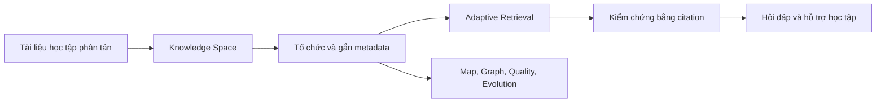
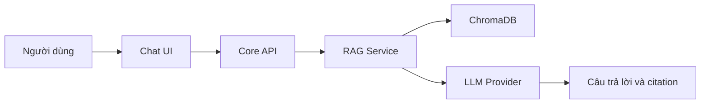
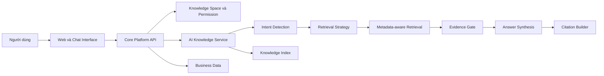

# Báo cáo sự khác nhau giữa RAG Chatbot ban đầu và AI Knowledge Platform của UniChat

Ngày cập nhật: 2026-07-12

## 1. Mục đích báo cáo

Báo cáo này giải thích sự thay đổi định hướng của UniChat từ hệ thống hỏi đáp tài liệu sử dụng RAG sang AI Knowledge Platform dành cho giáo dục đại học. Nội dung được đối chiếu từ hồ sơ dự án hiện có, các bản sao trước ngày đổi định hướng 2026-07-10, tài liệu kiến trúc mới và nhật ký quyết định.

Báo cáo tập trung trả lời bốn câu hỏi:

1. UniChat ban đầu thực sự là sản phẩm gì?
2. AI Knowledge Platform khác RAG Chatbot ở đâu?
3. Sự thay đổi ảnh hưởng thế nào đến kiến trúc, chức năng, dữ liệu, đánh giá và tiến độ?
4. Phạm vi nào nên triển khai trong khóa luận để vừa khả thi vừa có điểm mới?

## 2. Kết luận ngắn gọn

UniChat không cần bỏ toàn bộ thiết kế cũ. Phần lớn nền móng kỹ thuật vẫn phù hợp, gồm Workspace, upload PDF/DOCX/TXT, xử lý tài liệu, PostgreSQL, ChromaDB, Spring Boot, FastAPI, phân quyền, citation, lịch sử chat và cơ chế từ chối khi thiếu bằng chứng.

Thay đổi quan trọng nằm ở cách định vị và trọng tâm nghiên cứu:

- Trước đây, sản phẩm được mô tả chủ yếu bằng luồng "upload tài liệu -> hỏi -> nhận câu trả lời có citation".
- Hiện nay, sản phẩm được định vị là nền tảng tổ chức và khai thác tri thức; chat chỉ là một giao diện truy cập tri thức.
- Trong khóa luận, nhóm không triển khai toàn bộ nền tảng mà chỉ triển khai module đầu tiên: **Adaptive Knowledge Retrieval & Reasoning**.
- Điểm mới không còn là "ứng dụng RAG để đọc tài liệu", mà là điều chỉnh chiến lược retrieval theo loại câu hỏi, metadata và độ tin cậy của bằng chứng.

Workspace hiện chủ yếu là tài liệu thiết kế và kế hoạch, chưa có codebase ứng dụng hoàn chỉnh. Vì vậy, đây là thời điểm có chi phí thấp để đổi định hướng. Ảnh hưởng hiện tại tập trung vào tài liệu, backlog, mô hình dữ liệu, hợp đồng API và cách đánh giá; chưa phát sinh chi phí di chuyển mã nguồn lớn.

## 3. UniChat ban đầu là gì?

Theo phạm vi và SRS trước khi đổi định hướng, UniChat ban đầu là Web Application hỏi đáp tài liệu học tập bằng tiếng Việt. Luồng giá trị chính gồm:

1. Người dùng đăng ký hoặc đăng nhập.
2. Người dùng tạo Workspace theo môn học hoặc chủ đề.
3. Người dùng upload PDF, DOCX hoặc TXT.
4. AI Service trích xuất, làm sạch, chia chunk, tạo embedding và lưu vào ChromaDB.
5. Người dùng đặt câu hỏi trong Workspace.
6. Hệ thống semantic search trong phạm vi đã được phân quyền.
7. LLM sinh câu trả lời dựa trên context đã retrieval.
8. Hệ thống hiển thị citation và lưu lịch sử.
9. Khi context yếu, hệ thống từ chối hoặc yêu cầu người dùng hỏi rõ hơn.

Đây là thiết kế RAG có kiểm soát và có giá trị thực tế. Tuy nhiên, câu chuyện sản phẩm vẫn tập trung vào tính năng chat và pipeline hỏi đáp. Các năng lực như mindmap, OCR, voice, LMS và analytics được xếp thành tính năng mở rộng rời rạc, chưa được gom thành tầm nhìn quản trị tri thức thống nhất.

## 4. AI Knowledge Platform là gì trong UniChat?

AI Knowledge Platform của UniChat là nền tảng biến tài liệu học tập phân tán thành các Knowledge Space có thể tổ chức, truy xuất, kiểm chứng và phát triển theo thời gian.

Trong định hướng này:

- Workspace là phiên bản triển khai hiện tại của Knowledge Space.
- Tài liệu không chỉ là file để chatbot đọc mà là nguồn hình thành kho tri thức.
- Metadata, cấu trúc tài liệu, nguồn trích dẫn và quan hệ giữa nội dung trở thành tài sản cốt lõi.
- Retrieval là năng lực nền tảng và có thể thay đổi theo mục đích câu hỏi.
- Chat là một giao diện sử dụng nền tảng, không phải toàn bộ sản phẩm.
- Knowledge Map, Knowledge Graph, Knowledge Quality và Knowledge Evolution là các module phát triển sau MVP.

## 5. Bảng so sánh trực tiếp

| Khía cạnh | RAG Chatbot ban đầu | AI Knowledge Platform | Ý nghĩa đối với UniChat |
|---|---|---|---|
| Định vị | Trợ lý hỏi đáp tài liệu học tập | UNICHAT - NỀN TẢNG QUẢN TRỊ VÀ KHAI THÁC TRI THỨC HỌC TẬP ỨNG DỤNG AI | Tên đề tài và phần giới thiệu phải nhấn mạnh tri thức, không chỉ chat |
| Vấn đề trung tâm | Khó tìm câu trả lời trong nhiều tài liệu | Tri thức phân tán, trùng lặp, khó tổ chức, truy xuất và kiểm chứng | Bài toán rộng hơn và có giá trị sản phẩm dài hạn hơn |
| Đơn vị cốt lõi | Conversation và tài liệu upload | Knowledge Space, tài liệu, metadata và lịch sử khai thác | Workspace được giữ lại nhưng được giải thích như Knowledge Space |
| Vai trò của chat | Trải nghiệm chính của sản phẩm | Một giao diện truy cập nền tảng | UI vẫn có chat nhưng kiến trúc không phụ thuộc hoàn toàn vào chat |
| Cách retrieval | Semantic search với Top-K tương đối cố định | Chiến lược thay đổi theo intent, metadata, phạm vi và độ tin cậy | Cần Intent Detector và Retrieval Strategy Selector |
| Xử lý bằng chứng | Lấy chunk liên quan rồi đưa vào LLM | Gom bằng chứng, kiểm tra đủ/thiếu trước khi sinh đáp án | Evidence Gate trở thành thành phần rõ ràng |
| Citation | Tính năng chống hallucination | Cơ chế truy vết tri thức bắt buộc | Citation tiếp tục là yêu cầu lõi |
| Đánh giá | Đúng/sai, Faithfulness, Answer Relevance | Thêm intent accuracy, strategy correctness, citation accuracy và refusal correctness | Cần bộ test phân nhóm theo loại câu hỏi |
| Dữ liệu | User, Workspace, Document, Conversation, Message, Citation | Giữ dữ liệu cũ và thêm RetrievalTrace, EvaluationCase, EvaluationResult | Không thay toàn bộ database, chỉ mở rộng có chủ đích |
| Giá trị sau upload | Chờ người dùng đặt câu hỏi | Có thể chủ động tổ chức, tóm tắt, phát hiện trùng lặp và tạo bản đồ tri thức | Phần chủ động thuộc roadmap, chưa bắt buộc trong MVP |
| Khả năng mở rộng | Thêm từng tính năng OCR, voice, mindmap | Mở rộng thành các module tri thức có ranh giới rõ | Roadmap mạch lạc hơn |
| Điểm mới khóa luận | Áp dụng RAG cho hỏi đáp tài liệu | Adaptive Knowledge Retrieval & Reasoning | Dễ chứng minh đóng góp kỹ thuật hơn chatbot RAG thông thường |
| Rủi ro phạm vi | Dễ bị đánh giá giống nhiều sản phẩm chat với PDF | Dễ quá rộng nếu tuyên bố triển khai toàn bộ platform | Phải tách rõ tầm nhìn và phạm vi hiện thực hóa |

## 6. Kiến trúc thay đổi như thế nào?

### 6.1. Kiến trúc ban đầu

Kiến trúc này tối ưu cho một luồng hỏi đáp. Thành phần AI chủ yếu nhận câu hỏi, tìm Top-K chunk, tạo prompt và gọi LLM.

### 6.2. Kiến trúc sau khi đổi định hướng

Thay đổi kiến trúc tập trung trong AI Knowledge Service. Core Platform API, phân quyền và các kho dữ liệu chính vẫn được giữ. Các thành phần mới hoặc cần tách rõ gồm:

- Intent Detection v1: phân loại câu hỏi định nghĩa, fact QA, so sánh, tổng hợp, reasoning hoặc ngoài phạm vi.
- Retrieval Strategy Selector: chọn Top-K, threshold, metadata filter và cách gom bằng chứng.
- Evidence Gate: quyết định context đã đủ để trả lời hay chưa.
- Retrieval Trace: ghi intent, chiến lược, điểm retrieval và kết quả để đánh giá.
- Evaluation module: đánh giá riêng chất lượng retrieval và câu trả lời theo từng loại câu hỏi.

## 7. Những gì được giữ nguyên

- Frontend: React, Vite, TailwindCSS và React Router.
- Core API: Spring Boot, Spring Security và JWT.
- AI Service: Python FastAPI.
- Dữ liệu nghiệp vụ: PostgreSQL.
- Vector index: ChromaDB.
- File storage: local trong khóa luận, có interface nâng cấp MinIO.
- LLM Provider: Gemini API, có phương án Ollama.
- Định dạng bắt buộc: PDF, DOCX và TXT.
- Chức năng nền: auth, Workspace, document management, chat history, citation và admin cơ bản.
- Bảo mật: Core API kiểm tra quyền trước khi AI Service retrieval.
- Chống hallucination: không đủ bằng chứng thì từ chối hoặc hỏi lại.

Hệ thống cũ trở thành **lát cắt triển khai đầu tiên** của nền tảng mới, thay vì bị loại bỏ.

## 8. Những gì phải thay đổi hoặc bổ sung

### 8.1. Tài liệu và cách trình bày đề tài

- Chuyển mô tả từ "trợ lý hỏi đáp tài liệu dùng RAG" sang "AI Knowledge Platform cho giáo dục đại học".
- Ghi rõ khóa luận chỉ hiện thực hóa module Adaptive Knowledge Retrieval & Reasoning.
- Mô tả tính mới bằng cơ chế thích ứng và phương pháp đánh giá, không chỉ liệt kê công nghệ.
- Đặt Knowledge Map, Graph, Quality và Evolution trong hướng phát triển.

### 8.2. AI Service

- Bổ sung bộ phân loại intent cơ bản.
- Thay Top-K cố định bằng retrieval budget theo loại câu hỏi.
- Bổ sung metadata filter theo Workspace, Document, Chapter hoặc Section khi dữ liệu cho phép.
- Bổ sung Evidence Gate và ngưỡng từ chối.
- Ghi RetrievalTrace để giải thích và đánh giá quyết định retrieval.

### 8.3. Core API và dữ liệu

- API hỏi đáp nhận Workspace scope và trả thêm intent, strategy summary, citations và trạng thái đủ bằng chứng.
- PostgreSQL thêm RetrievalTrace, EvaluationCase và EvaluationResult.
- Core API tiếp tục là ranh giới authorization duy nhất.

### 8.4. Frontend

- Màn hình chính ưu tiên Knowledge Space/Workspace và tài liệu trước khi vào chat.
- Citation phải đủ rõ để người dùng kiểm chứng nguồn.
- Không cần xây Knowledge Map hoặc Graph trong MVP.

### 8.5. Kiểm thử và đánh giá

Bộ dữ liệu đánh giá cần có ít nhất năm nhóm:

1. Câu hỏi định nghĩa.
2. Câu hỏi sự kiện hoặc fact QA.
3. Câu hỏi so sánh nhiều nguồn.
4. Câu hỏi tổng hợp hoặc reasoning.
5. Câu hỏi ngoài phạm vi tài liệu.

Chỉ số cần ghi nhận gồm intent classification correctness, retrieval strategy correctness, citation accuracy, answer groundedness, refusal correctness và response time.

## 9. Ảnh hưởng tổng quan đến dự án

| Khu vực | Mức ảnh hưởng | Nội dung ảnh hưởng |
|---|---|---|
| Tầm nhìn sản phẩm | Cao | Thay đổi cách mô tả vấn đề, giá trị và roadmap |
| Phạm vi MVP | Trung bình | Giữ luồng cũ nhưng thêm Adaptive Retrieval v1 |
| Kiến trúc tổng thể | Thấp đến trung bình | Giữ stack và service split; mở rộng AI Service và evaluation |
| Cơ sở dữ liệu | Thấp | Bổ sung bảng trace và evaluation |
| API | Trung bình | Mở rộng hợp đồng hỏi đáp với intent, strategy và evidence |
| Frontend | Thấp trong MVP | Đổi ưu tiên điều hướng; chat và citation vẫn giữ |
| Kế hoạch phát triển | Trung bình | Thêm task intent, strategy, trace và test theo loại câu hỏi |
| Rủi ro kỹ thuật | Trung bình | Phải định nghĩa rule retrieval đơn giản, triển khai và đo được |
| Giá trị học thuật | Cao | Có baseline, giả thuyết và tiêu chí so sánh rõ hơn |

## 10. Phạm vi khóa luận được khuyến nghị

### Bắt buộc triển khai

- Auth và phân quyền USER/ADMIN.
- Workspace/Knowledge Space và quyền truy cập.
- Upload, quản lý và xử lý PDF/DOCX/TXT.
- Chunking, embedding, ChromaDB và metadata nguồn.
- Intent Detection v1 với tập loại câu hỏi hữu hạn.
- Dynamic Retrieval Budget và metadata-aware retrieval.
- Evidence Gate, từ chối khi thiếu bằng chứng và citation.
- Lưu conversation, message, citation và retrieval trace.
- Bộ test theo intent và so sánh với baseline Top-K cố định.
- Admin dashboard cơ bản và hướng dẫn chạy hệ thống.

### Không nên đưa vào MVP

- Knowledge Graph hoàn chỉnh.
- Knowledge Map tự động quy mô lớn.
- Knowledge Quality scoring toàn diện.
- Knowledge Evolution và so sánh phiên bản thông minh.
- Multi-agent debate hoặc nhiều nhánh reasoning song song.
- OCR, voice, LMS, mobile app, native PPTX/XLSX.
- Community Knowledge, quiz, flashcard và study plan đầy đủ.

Các nội dung này phù hợp với roadmap nhưng sẽ làm khóa luận mất trọng tâm nếu triển khai đồng thời.

## 11. Cách chứng minh điểm mới

Đề tài nên xây baseline RAG cố định và phiên bản Adaptive Retrieval v1 trên cùng bộ tài liệu, tập câu hỏi và LLM Provider.

Baseline:

`Question -> Semantic Search Top-K cố định -> LLM -> Answer`

Phiên bản đề xuất:

`Question -> Intent Detection -> Retrieval Strategy -> Evidence Gate -> LLM/Refusal -> Citation`

Kết quả cần so sánh theo từng nhóm câu hỏi. Nếu Adaptive Retrieval chọn nguồn phù hợp hơn, citation chính xác hơn, biết từ chối tốt hơn hoặc dùng ít context hơn cho câu hỏi đơn giản, nhóm có bằng chứng rõ ràng cho đóng góp của đề tài.

## 12. Rủi ro và biện pháp kiểm soát

| Rủi ro | Hệ quả | Cách kiểm soát |
|---|---|---|
| Tuyên bố platform nhưng demo chỉ có chat | Hội đồng có thể cho rằng chỉ đổi tên | Giải thích platform là tầm nhìn, Adaptive Retrieval là module đầu tiên |
| Intent quá nhiều hoặc quá phức tạp | Tăng thời gian và khó đánh giá | Giới hạn 5-6 loại intent, ưu tiên giải pháp có thể giải thích |
| Adaptive Retrieval không hơn baseline | Không chứng minh được tính mới | Dataset phải có definition, comparison, summary và out-of-scope |
| Metadata tài liệu không ổn định | Retrieval theo chapter kém chính xác | Bắt đầu bằng workspaceId, documentId, pageNumber và chunkIndex |
| Phạm vi platform quá rộng | Không hoàn thành đúng tiến độ | Đóng băng MVP theo danh sách bắt buộc |
| Citation đúng file nhưng sai đoạn | Giảm độ tin cậy | Lưu chunk id, excerpt, page/position và score; kiểm thử thủ công |

## 13. Cách trình bày ngắn gọn với giảng viên hướng dẫn

> UniChat được định hướng dài hạn là một AI Knowledge Platform cho giáo dục đại học, nơi tài liệu được tổ chức thành các Knowledge Space và có thể được truy xuất, kiểm chứng, mở rộng theo thời gian. Trong phạm vi khóa luận, nhóm không xây toàn bộ nền tảng mà triển khai module Adaptive Knowledge Retrieval & Reasoning. Module này mở rộng RAG truyền thống bằng cách nhận diện loại câu hỏi, điều chỉnh chiến lược retrieval, đánh giá độ đầy đủ của bằng chứng, trả lời có citation và từ chối khi không đủ căn cứ.

Thông điệp này vừa thể hiện tầm nhìn sản phẩm, vừa giữ lời hứa triển khai ở mức thực tế.

## 14. Kết luận

Sự thay đổi từ RAG Chatbot sang AI Knowledge Platform là thay đổi về **trung tâm giá trị**, không phải thay toàn bộ công nghệ. RAG Chatbot xem câu trả lời là đầu ra chính; AI Knowledge Platform xem kho tri thức có tổ chức, có nguồn gốc và có khả năng khai thác lâu dài là tài sản chính.

Đối với UniChat, hướng phù hợp nhất là giữ kiến trúc nền hiện có, nâng cấp AI Service bằng Adaptive Retrieval v1 và xây cơ chế đánh giá đủ rõ để chứng minh hiệu quả. Đây là phương án cân bằng giữa tầm nhìn sản phẩm rộng, điểm mới học thuật và tính khả thi của khóa luận.

## 15. Tài liệu dự án đã đối chiếu

- Phiếu đề xuất đề tài hiện tại và bản sao trước khi đổi định hướng.
- Tài liệu phạm vi dự án hiện tại và bản sao trước khi đổi định hướng.
- SRS UniChat hiện tại và bản sao trước khi đổi định hướng.
- Danh sách chức năng chính hiện tại và bản sao trước khi đổi định hướng.
- Đề xuất cấu trúc và thiết kế hiện tại cùng bản sao trước khi đổi định hướng.
- Báo cáo khóa luận Chương 1-3 hiện tại và bản sao trước khi đổi định hướng.
- Thiết kế sơ lược AI Knowledge Platform.
- Architecture Decision, File Plan, Decisions Log và Codebase Analysis.
- Nội dung thảo luận định hướng sản phẩm do người dùng cung cấp.