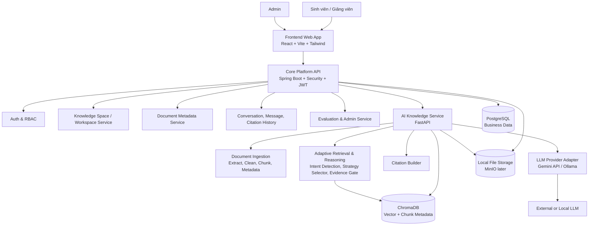
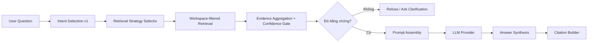

# Thiết kế sơ lược hệ thống UniChat theo hướng AI Knowledge Platform

Ngày cập nhật: 2026-07-10

## 1. Định vị hệ thống

UniChat được thiết kế như một AI Knowledge Platform cho môi trường đại học. Giá trị chính của hệ thống không nằm ở việc tạo một chatbot đọc file, mà ở việc biến tài liệu học tập phân tán thành các Knowledge Space có thể quản lý, truy xuất, kiểm chứng và mở rộng theo thời gian.

Trong phạm vi khóa luận, hệ thống không triển khai toàn bộ nền tảng tri thức. Phạm vi triển khai ban đầu là module Adaptive Knowledge Retrieval & Reasoning, đóng vai trò lát cắt đầu tiên của nền tảng: người dùng tạo Workspace/Knowledge Space, upload tài liệu, hệ thống xử lý tài liệu, gắn metadata, nhận diện ý định câu hỏi ở mức cơ bản, chọn chiến lược truy xuất phù hợp, trả lời có citation và từ chối khi thiếu bằng chứng.

## 2. Nguyên tắc thiết kế

- Knowledge-first: tài liệu được tổ chức và xử lý thành kho tri thức trước khi người dùng hỏi.
- Chat là giao diện, không phải toàn bộ sản phẩm.
- Workspace trong phạm vi triển khai hiện tại là hiện thực kỹ thuật của Knowledge Space.
- Core API kiểm tra quyền trước khi AI/RAG Service truy xuất dữ liệu.
- AI/RAG Service không quyết định phân quyền người dùng, chỉ xử lý yêu cầu đã được Core API giới hạn theo workspaceId/documentId.
- Retrieval không dùng một Top-K cố định cho mọi câu hỏi; hệ thống có Adaptive Retrieval v1 theo loại câu hỏi.
- Câu trả lời học thuật phải có citation hoặc phải từ chối/hỏi lại khi thiếu bằng chứng.
- Các năng lực Knowledge Map, Knowledge Graph, Knowledge Quality và Knowledge Evolution là hướng mở rộng sau module đầu tiên.

## 3. Kiến trúc tổng quan

## 4. Các lớp chính

| Lớp | Thành phần | Vai trò |
|---|---|---|
| Presentation | Frontend Web App | Giao diện đăng nhập, Knowledge Space/Workspace, tài liệu, hỏi đáp, citation, lịch sử và admin dashboard. |
| Core Platform | Core API Service | Xác thực, phân quyền, nghiệp vụ Workspace, metadata tài liệu, lịch sử chat, citation history, admin và evaluation records. |
| AI Knowledge | AI Knowledge Service | Xử lý tài liệu, chunking, embedding, intent detection, adaptive retrieval, prompt assembly, citation và gọi LLM. |
| Business Data | PostgreSQL | Lưu user, role, workspace, document metadata, conversation, message, citation, evaluation case/result. |
| Knowledge Index | ChromaDB | Lưu embedding và metadata chunk để truy xuất theo ngữ nghĩa, workspaceId, documentId, pageNumber, chunkIndex. |
| Storage | Local File Storage | Lưu file gốc trong phạm vi khóa luận; thiết kế interface để nâng cấp MinIO/S3-compatible storage. |
| Provider | Gemini API / Ollama | Sinh câu trả lời dựa trên context đã truy xuất, thông qua provider adapter để tránh phụ thuộc cứng. |

## 5. Module MVP: Adaptive Knowledge Retrieval & Reasoning

Module này là điểm mới chính của đề tài. Thay vì pipeline cố định Question -> Top-K Retrieval -> LLM, hệ thống dùng pipeline:

### Intent Detection v1

| Loại câu hỏi | Ví dụ | Retrieval strategy đề xuất |
|---|---|---|
| Definition | “JWT là gì?” | Top 2-3 chunk có điểm cao, ưu tiên đoạn định nghĩa. |
| Fact QA | “Hệ thống dùng database nào?” | Top 3-5 chunk, strict threshold, trả lời ngắn. |
| Comparison | “Gemini và Ollama khác nhau thế nào?” | Top 8-12 chunk từ nhiều tài liệu/section, gom evidence theo đối tượng so sánh. |
| Summary | “Tóm tắt chương RAG.” | Truy xuất theo document/chapter/section metadata nếu có, giới hạn theo phạm vi tài liệu. |
| Reasoning / Multi-hop | “Vì sao cần kiểm tra quyền trước retrieval?” | Multi-retrieval nhỏ, gom bằng chứng theo bước lập luận. |
| Out-of-scope | “Dự đoán đề thi năm sau?” | Không gọi LLM trả lời tự do; từ chối hoặc hỏi lại. |

## 6. Luồng xử lý tài liệu

1. Người dùng upload PDF/DOCX/TXT vào Knowledge Space/Workspace.
2. Core API xác thực JWT, kiểm tra quyền Workspace, validate file type/size.
3. Core API lưu file gốc vào storage và metadata vào PostgreSQL với trạng thái uploaded/processing.
4. Core API gửi documentId, workspaceId và storagePath sang AI Knowledge Service.
5. AI Knowledge Service trích xuất text, chuẩn hóa nội dung, chia chunk và gắn metadata nguồn.
6. AI Knowledge Service tạo embedding và lưu vào ChromaDB kèm workspaceId, documentId, fileName, pageNumber/position, chunkIndex.
7. Core API cập nhật trạng thái document thành processed hoặc failed.

## 7. Luồng hỏi đáp có retrieval thích ứng

1. Người dùng đặt câu hỏi trong một Workspace.
2. Core API kiểm tra quyền Workspace trước khi gọi AI Knowledge Service.
3. AI Knowledge Service phân loại intent câu hỏi.
4. Strategy Selector chọn topK, threshold, metadata filter và cách gom bằng chứng.
5. Retrieval chỉ truy xuất chunk thuộc workspaceId/documentId hợp lệ.
6. Evidence Gate đánh giá context có đủ tin cậy không.
7. Nếu thiếu bằng chứng, hệ thống từ chối hoặc hỏi lại.
8. Nếu đủ bằng chứng, Prompt Builder gọi LLM Provider.
9. Citation Builder gắn file, page/position, excerpt, score vào câu trả lời.
10. Core API lưu conversation, message, citation history và retrieval/evaluation log tối thiểu.

## 8. Mô hình dữ liệu đề xuất

| Entity | Bắt buộc trong module đầu tiên | Vai trò |
|---|---:|---|
| User | Có | Tài khoản, role, trạng thái. |
| Workspace / KnowledgeSpace | Có | Đơn vị tổ chức tài liệu và phạm vi truy xuất. |
| WorkspaceMember | Có | Chia sẻ Workspace và kiểm tra quyền. |
| Document | Có | Metadata file upload, trạng thái xử lý, storagePath. |
| ChunkMetadata | Có | Metadata chunk dùng cho citation, permission filter và retrieval. |
| Conversation | Có | Phiên hỏi đáp trong Workspace. |
| Message | Có | Câu hỏi/câu trả lời. |
| CitationHistory | Có | Lưu nguồn tham chiếu của assistant message. |
| RetrievalTrace | Nên có | Lưu intent, strategy, topK, threshold, scores để đánh giá điểm mới của đề tài. |
| EvaluationCase | Có | Bộ câu hỏi test theo intent, expected source/answer. |
| EvaluationResult | Có | Actual answer, citation accuracy, strategy correctness, notes. |
| KnowledgeNode | Sau MVP | Node cho Knowledge Map/Graph. |
| DocumentQualityScore | Sau MVP | Coverage, freshness, reliability, citation quality. |
| DocumentVersion | Sau MVP | Theo dõi Knowledge Evolution/version diff. |

## 9. API sơ lược

| Nhóm API | Endpoint gợi ý | Vai trò |
|---|---|---|
| Auth | POST /api/auth/register, POST /api/auth/login | Đăng ký, đăng nhập, nhận JWT. |
| Workspace | /api/workspaces | CRUD Knowledge Space/Workspace, chia sẻ, kiểm tra quyền. |
| Document | /api/workspaces/{workspaceId}/documents | Upload, list, delete, status. |
| Ask | POST /api/workspaces/{workspaceId}/questions | Gửi câu hỏi, nhận answer + citations + refusal flag. |
| History | /api/workspaces/{workspaceId}/conversations | Lịch sử hội thoại và citation. |
| Admin | /api/admin/* | User list, lock/unlock, metrics cơ bản. |
| AI Internal | POST /ai/documents/{documentId}/process | Xử lý tài liệu. |
| AI Internal | POST /ai/retrieval/answer | Intent detection, retrieval, answer synthesis, citation. |
| Evaluation | /api/evaluation/* | Bộ câu hỏi test, kết quả đánh giá theo intent. |

## 10. Đánh giá chất lượng module

Để chứng minh sự mới mẻ, phần đánh giá không chỉ hỏi “có trả lời đúng không”, mà cần đo các khía cạnh sau:

| Tiêu chí | Ý nghĩa |
|---|---|
| Intent classification correctness | Hệ thống nhận diện đúng loại câu hỏi ở mức cơ bản. |
| Retrieval strategy correctness | TopK/threshold/filter được chọn phù hợp với loại câu hỏi. |
| Citation accuracy | Citation trỏ đúng tài liệu, trang/vị trí và excerpt. |
| Answer groundedness | Câu trả lời bám evidence, không dùng tri thức ngoài tài liệu. |
| Refusal correctness | Câu hỏi ngoài phạm vi được từ chối/hỏi lại. |
| Response time | Thời gian phản hồi chấp nhận được trong demo. |

## 11. Phạm vi sau MVP

Các module sau không nên đưa vào phạm vi triển khai đầu tiên, nhưng nên xuất hiện trong hướng phát triển để giữ tầm nhìn AI Knowledge Platform:

- Knowledge Map: duyệt tri thức theo chủ đề, chương, khái niệm.
- Knowledge Graph: quan hệ giữa khái niệm, tài liệu, câu hỏi, bài tập.
- Knowledge Quality: coverage, difficulty, freshness, reliability, citation quality.
- Knowledge Evolution: so sánh phiên bản tài liệu, phát hiện nội dung mới/xóa/thay đổi.
- Knowledge Curation: duplicate detection, contradiction detection, version suggestion.
- AI Study Assistant: study plan, quiz, flashcard, FAQ.
- Community Knowledge: bookmark, comment, câu hỏi liên quan, mức độ sử dụng.
- OCR, native PPTX/XLSX, streaming, reranker, hybrid search, LMS integration.

## 12. Kết luận thiết kế

Thiết kế mới giúp UniChat có hai lớp rõ ràng: tầm nhìn dài hạn là AI Knowledge Platform, phạm vi khóa luận là module Adaptive Knowledge Retrieval & Reasoning. Cách này giữ đề tài có tính mới so với RAG truyền thống nhưng vẫn đủ thực tế để triển khai trong thời gian khóa luận.