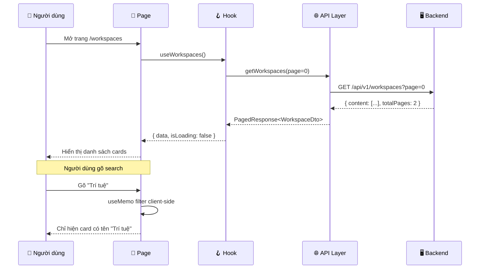

# Hướng Dẫn Triển Khai Chức Năng Từ A Đến Z

> Tài liệu này dùng chức năng **Workspace List** làm ví dụ xuyên suốt.

---

## Bước 0: Tư Duy Trước Khi Code

Trước khi viết bất kỳ dòng code nào, bạn cần trả lời 3 câu hỏi:

| # | Câu hỏi | Ví dụ Workspace List |
|---|---------|---------------------|
| 1 | **Người dùng sẽ thấy gì?** | Danh sách card workspace, ô search, nút filter, nút tạo mới |
| 2 | **Dữ liệu lấy từ đâu?** | API backend: `GET /api/v1/workspaces` |
| 3 | **Người dùng tương tác gì?** | Tìm kiếm, lọc, click card, tạo workspace mới |

Từ 3 câu hỏi này, bạn sẽ biết cần tạo những file gì.

---

## Bước 1: Xác Định Cần Tạo Những File Gì

### Quy tắc: Mỗi file chỉ làm MỘT việc

Hãy tưởng tượng bạn đang xây một nhà hàng:

```
🏪 Nhà hàng (Trang Workspace List)
│
├── 📋 Thực đơn (Schema)         → Định nghĩa "món ăn trông như thế nào"
├── 🚚 Nhà cung cấp (API)        → Đi lấy nguyên liệu từ kho
├── 👨‍🍳 Đầu bếp (Hooks)           → Quản lý việc nấu nướng
├── 🍽️ Bàn ăn (Components)       → Trình bày món ăn cho khách
└── 🏠 Phòng ăn (Page)           → Sắp xếp tất cả lại thành nhà hàng
```

Tương ứng với các file thật:

```
features/workspaces/
├── workspace-schema.ts    ← Thực đơn: Dữ liệu trông như nào?
├── workspace-api.ts       ← Nhà cung cấp: Gọi API lấy dữ liệu
├── workspace-hooks.ts     ← Đầu bếp: Quản lý trạng thái dữ liệu
├── workspace-list-page.tsx ← Phòng ăn: Trang chính
├── components/
│   ├── workspace-card.tsx  ← Bàn ăn: Hiển thị 1 workspace
│   ├── workspace-form.tsx  ← Bàn ăn: Form tạo mới
│   └── skeleton-card.tsx   ← Bàn ăn: Placeholder khi loading
└── index.ts               ← Cổng ra: Export cho bên ngoài dùng
```

---

## Bước 2: Bắt Đầu Từ Đâu? (Thứ Tự Triển Khai)

> [!IMPORTANT]
> **Luôn code từ "trong" ra "ngoài"**: Schema → API → Hooks → Components → Page

### Tại sao theo thứ tự này?

```
Schema ──▶ API ──▶ Hooks ──▶ Components ──▶ Page
  │          │        │          │              │
  │          │        │          │              └─ Dùng Components
  │          │        │          └─ Dùng Hooks
  │          │        └─ Dùng API
  │          └─ Dùng Schema
  └─ Không phụ thuộc ai cả (nên làm đầu tiên!)
```

Mỗi tầng **phụ thuộc** vào tầng trước nó. Nếu bạn code Page trước, bạn sẽ không biết dữ liệu trông như nào!

---

## Bước 3: Triển Khai Từng File

### 3.1 — Schema: "Dữ liệu trông như thế nào?"

**Mục đích:** Định nghĩa kiểu dữ liệu TypeScript cho workspace.

**Cách làm:**
1. Mở file backend `WorkspaceResponse.java` để xem server trả về gì
2. Tạo interface TypeScript tương ứng

**Ví dụ thực tế:**

```java
// Backend trả về (Java):
public record WorkspaceResponse(
    UUID id,
    String name,
    String description,
    WorkspaceVisibility visibility,
    long documentCount,
    long memberCount,
    Instant createdAt,
    Instant updatedAt
) {}
```

```typescript
// Frontend nhận (TypeScript) → workspace-schema.ts:
export interface WorkspaceDto {
  readonly id: string;          // UUID → string
  readonly name: string;
  readonly description: string;
  readonly visibility: 'PRIVATE' | 'SHARED' | 'PUBLIC';
  readonly documentCount: number; // long → number
  readonly memberCount: number;
  readonly createdAt: string;    // Instant → ISO string
  readonly updatedAt: string;
}
```

> [!TIP]
> **Mẹo:** Java `UUID` → TS `string`, Java `long` → TS `number`, Java `Instant` → TS `string` (ISO format)

**Thêm Zod schema** nếu có form nhập liệu:
```typescript
export const createWorkspaceSchema = z.object({
  name: z.string().min(3, 'Tên ít nhất 3 ký tự').max(100),
  description: z.string().max(1000).optional().default(''),
  visibility: z.enum(['PRIVATE', 'SHARED', 'PUBLIC']),
});
```

---

### 3.2 — API: "Gọi server như thế nào?"

**Mục đích:** Tạo các hàm gọi API endpoint.

**Cách làm:**
1. Xem file `api-contracts.md` để biết URL endpoint
2. Dùng hàm `fetchJson` có sẵn trong `lib/api-client.ts`

```typescript
// workspace-api.ts
import { fetchJson } from '../../lib/api-client';
import type { PagedResponse, WorkspaceDto } from './workspace-schema';

// GET /api/v1/workspaces?page=0&size=20
export function getWorkspaces(page = 0, size = 20): Promise<PagedResponse<WorkspaceDto>> {
  return fetchJson(`/workspaces?page=${page}&size=${size}`);
}

// POST /api/v1/workspaces (cần Idempotency-Key)
export function createWorkspace(data: CreateWorkspaceInput): Promise<WorkspaceDto> {
  return fetchJson('/workspaces', {
    method: 'POST',
    body: JSON.stringify(data),
    headers: { 'Idempotency-Key': crypto.randomUUID() },
  });
}
```

> [!NOTE]
> `fetchJson` tự động thêm token xác thực và xử lý lỗi. Bạn chỉ cần truyền URL path (không cần `/api/v1` prefix vì đã cấu hình trong `api-client.ts`). Kiểm tra lại file `api-client.ts` để chắc chắn.

---

### 3.3 — Hooks: "Quản lý dữ liệu như thế nào?"

**Mục đích:** Dùng React Query để tự động fetch, cache, và cập nhật dữ liệu.

**Tại sao cần Hooks thay vì gọi API trực tiếp?**

```
❌ Không dùng Hooks (cách cũ, phức tạp):
   Component → gọi API → useState loading → useState data → useState error
   → useEffect fetch → xử lý cleanup → re-fetch khi cần...
   = 20-30 dòng code lặp đi lặp lại ở MỖI component

✅ Dùng React Query Hooks (cách mới, gọn):
   Component → useWorkspaces() → xong!
   React Query tự lo: loading, error, cache, re-fetch, retry...
```

**Code thực tế:**

```typescript
// workspace-hooks.ts

// 1. Tạo "chìa khóa" để React Query nhận biết dữ liệu
const workspaceKeys = {
  all: ['workspaces'] as const,
  list: (page: number) => [...workspaceKeys.all, 'list', page] as const,
};

// 2. Hook ĐỌC dữ liệu (useQuery)
export function useWorkspaces(page = 0) {
  return useQuery({
    queryKey: workspaceKeys.list(page),  // Chìa khóa cache
    queryFn: () => getWorkspaces(page),  // Hàm gọi API
  });
}
// → Trả về: { data, isLoading, error, refetch }

// 3. Hook GHI dữ liệu (useMutation)
export function useCreateWorkspace() {
  const queryClient = useQueryClient();
  return useMutation({
    mutationFn: (data) => createWorkspace(data),  // Gọi API POST
    onSuccess: () => {
      // Sau khi tạo thành công → làm mới danh sách
      queryClient.invalidateQueries({ queryKey: workspaceKeys.all });
    },
  });
}
// → Trả về: { mutate, isPending, error }
```

> [!TIP]
> **useQuery** = đọc dữ liệu (GET). **useMutation** = thay đổi dữ liệu (POST/PUT/DELETE).

---

### 3.4 — Components: "Hiển thị như thế nào?"

**Mục đích:** Tạo các "mảnh ghép" UI nhỏ, tái sử dụng được.

**Ví dụ WorkspaceCard:**
```tsx
// components/workspace-card.tsx
export function WorkspaceCard({ id, name, description, visibility, updatedAt }) {
  return (
    <Link to={`/workspaces/${id}`} className="workspace-card">
      <span className="workspace-card__badge">{visibility}</span>
      <h3 className="workspace-card__name">{name}</h3>
      <p className="workspace-card__desc">{description}</p>
      <span>Cập nhật: {formatRelativeTime(updatedAt)}</span>
    </Link>
  );
}
```

**Ví dụ SkeletonCard (loading placeholder):**
```tsx
// components/skeleton-card.tsx
export function SkeletonCard() {
  return (
    <div className="skeleton-card" aria-hidden="true">
      {/* Các div rỗng với CSS animation shimmer */}
      <div className="skeleton-bone skeleton-bone--title" />
      <div className="skeleton-bone skeleton-bone--desc" />
    </div>
  );
}
```

---

### 3.5 — Page: "Ghép tất cả lại!"

Đây là bước cuối cùng — bạn lắp ráp tất cả mảnh ghép:

```tsx
// workspace-list-page.tsx
function WorkspaceListPage() {
  // ① Lấy dữ liệu từ Hook
  const { data, isLoading, error } = useWorkspaces();

  // ② State cho search và filter
  const [searchQuery, setSearchQuery] = useState('');
  const [activeFilter, setActiveFilter] = useState('ALL');

  // ③ Lọc dữ liệu theo search + filter
  const filtered = useMemo(() => {
    return (data?.content ?? []).filter(ws => {
      const matchFilter = activeFilter === 'ALL' || ws.visibility === activeFilter;
      const matchSearch = ws.name.toLowerCase().includes(searchQuery.toLowerCase());
      return matchFilter && matchSearch;
    });
  }, [data, searchQuery, activeFilter]);

  // ④ Render theo trạng thái
  return (
    <main>
      {/* Header với search + filter */}
      <input value={searchQuery} onChange={e => setSearchQuery(e.target.value)} />

      {/* Trạng thái Loading */}
      {isLoading && <SkeletonCard />}

      {/* Trạng thái Lỗi */}
      {error && <div>Lỗi! <button onClick={refetch}>Thử lại</button></div>}

      {/* Trạng thái Rỗng */}
      {!isLoading && !error && filtered.length === 0 && <div>Chưa có workspace</div>}

      {/* Trạng thái Có dữ liệu */}
      {filtered.map(ws => <WorkspaceCard key={ws.id} {...ws} />)}
    </main>
  );
}
```

> [!IMPORTANT]
> **4 trạng thái bắt buộc phải xử lý:** Loading → Error → Empty → Data. Không bao giờ bỏ sót!

---

## Bước 4: Sơ Đồ Luồng Dữ Liệu Tổng Thể



---

## Bước 5: Checklist Khi Tự Triển Khai

Dùng checklist này mỗi khi bạn bắt đầu một chức năng mới:

- [ ] **Đọc API contract** — Xem `api-contracts.md` để biết endpoint URL, method, request/response format
- [ ] **Đọc backend code** — Xem Controller + Response DTO để biết chính xác dữ liệu trả về
- [ ] **Tạo Schema** — Map Java types sang TypeScript types
- [ ] **Tạo API functions** — Mỗi endpoint = 1 function
- [ ] **Tạo Hooks** — useQuery cho GET, useMutation cho POST/PUT/DELETE
- [ ] **Tạo Components** — Mỗi "mảnh" UI là 1 component riêng
- [ ] **Tạo Page** — Ghép components + hooks + states
- [ ] **Xử lý 4 states** — Loading, Error, Empty, Data
- [ ] **Chạy lint + build** — `npm run lint` và `npm run build`
- [ ] **Test thủ công** — Mở browser kiểm tra

---

## Tóm Tắt Bằng Hình Ảnh

```
┌─────────────────────────────────────────────┐
│              workspace-list-page.tsx         │  ← Trang chính
│  ┌──────────┐ ┌──────────┐ ┌──────────┐    │
│  │  Card 1  │ │  Card 2  │ │  Card 3  │    │  ← Components
│  └──────────┘ └──────────┘ └──────────┘    │
│         ▲           ▲           ▲           │
│         └───────────┼───────────┘           │
│                     │                       │
│            useWorkspaces() Hook             │  ← Hooks
│                     │                       │
│            getWorkspaces() API              │  ← API Layer
│                     │                       │
│           WorkspaceDto Schema               │  ← Schema
└─────────────────────────────────────────────┘
                      │
                      ▼
              🖥️ Backend Server
         GET /api/v1/workspaces
```
