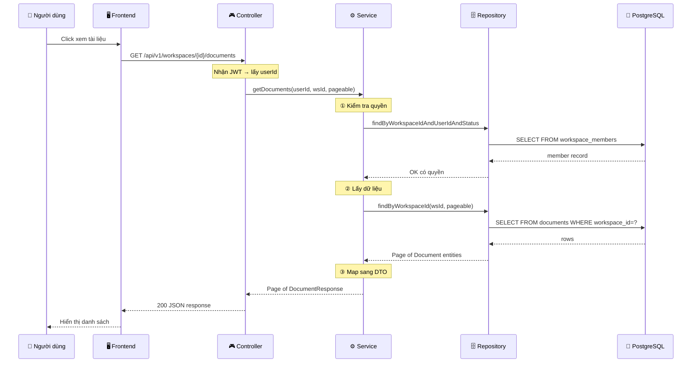

# Hướng Dẫn Triển Khai Chức Năng Fullstack (BE + FE)

> Tài liệu mở rộng từ `huong-dan-trien-khai-chuc-nang.md`, bổ sung **toàn bộ phần Backend**.
> Dùng chức năng **Document** (chưa có BE) làm ví dụ xuyên suốt.

---

## Tổng Quan: Luồng Fullstack

```
┌──────────────────── BACKEND (Java Spring Boot) ────────────────────┐
│                                                                     │
│  DB Migration → Entity → Repository → Service → Controller → DTO   │
│       ①            ②         ③           ④          ⑤          ⑥    │
│                                                                     │
└──────────────────────────────┬──────────────────────────────────────┘
                               │  HTTP JSON
┌──────────────────────────────▼──────────────────────────────────────┐
│                                                                     │
│  Schema → API → Hooks → Components → Page                          │
│    ⑦       ⑧      ⑨        ⑩          ⑪                            │
│                                                                     │
└──────────────── FRONTEND (React + TypeScript) ─────────────────────┘
```

**Thứ tự triển khai:** BE trước (①→⑥), FE sau (⑦→⑪).

---

## PHẦN A: BACKEND — Khi Chưa Có Gì

### Bước 0: Đọc Tài Liệu Thiết Kế

Trước khi code, **bắt buộc** đọc 3 file:

| File | Bạn tìm được gì? |
|------|-------------------|
| `docs/specifications/api-contracts.md` | URL endpoint, method, quyền truy cập |
| `docs/specifications/data-model.md` | Bảng DB, cột, ràng buộc, quan hệ |
| `docs/specifications/file-plan.md` | Cần tạo file gì, đặt ở đâu |

**Ví dụ Document:** Đọc xong bạn biết:
- Endpoint: `GET/POST /workspaces/{workspaceId}/documents`
- Bảng: `documents` (id, workspace_id, storage_key, original_name, status...)
- Files cần: DocumentController, DocumentService, DocumentRepository, Entity, DTO

---

### Bước 1: Cấu Trúc Thư Mục Backend

```
core-api/src/main/java/com/unichat/core/
├── common/              ← Module dùng chung (đã có)
│   ├── error/           ← AppError, GlobalErrorHandler...
│   └── web/             ← RequestIdFilter...
├── shared/              ← Utilities dùng chung (đã có)
│   ├── config/
│   ├── idempotency/
│   └── util/
├── auth/                ← Feature Auth (đã có)
│   ├── api/             ← Controller + Request/Response DTO
│   ├── domain/          ← Entity + Repository
│   └── service/         ← Business logic
├── workspace/           ← Feature Workspace (đã có)
│   ├── api/
│   ├── domain/
│   └── service/
└── document/            ← Feature Document (CHƯA CÓ → cần tạo!)
    ├── api/
    │   ├── DocumentController.java
    │   ├── UploadDocumentRequest.java
    │   └── DocumentResponse.java
    ├── domain/
    │   ├── Document.java
    │   ├── DocumentRepository.java
    │   ├── DocumentStatus.java
    │   └── MediaType.java
    └── service/
        └── DocumentService.java
```

> [!IMPORTANT]
> **Quy tắc cấu trúc:** Mỗi feature có 3 package: `api/` (Controller + DTO), `domain/` (Entity + Repository), `service/` (Business logic). Không bao giờ trộn lẫn!

---

### Bước 2: DB Migration — "Bảng dữ liệu trông như nào?"

**Mục đích:** Tạo bảng trong PostgreSQL bằng Flyway migration.

**Vị trí:** `core-api/src/main/resources/db/migration/`

**Quy tắc đặt tên:** `V{số}__tên_mô_tả.sql` (hai dấu gạch dưới!)

```sql
-- V5__documents_table.sql
-- (Số tiếp theo sau migration cuối cùng hiện có)

CREATE TABLE documents (
    id UUID PRIMARY KEY,
    workspace_id UUID NOT NULL REFERENCES workspaces(id) ON DELETE CASCADE,
    storage_key VARCHAR(255) NOT NULL UNIQUE,
    original_name VARCHAR(255) NOT NULL,
    media_type VARCHAR(100) NOT NULL,
    byte_size BIGINT NOT NULL,
    sha256 VARCHAR(64) NOT NULL,
    status VARCHAR(50) NOT NULL,
    version BIGINT NOT NULL DEFAULT 0,
    created_at TIMESTAMPTZ NOT NULL DEFAULT CURRENT_TIMESTAMP,
    updated_at TIMESTAMPTZ NOT NULL DEFAULT CURRENT_TIMESTAMP,
    CONSTRAINT chk_documents_status
        CHECK (status IN ('PENDING','PROCESSING','PROCESSED','FAILED','DELETING'))
);

CREATE INDEX idx_documents_workspace_status
    ON documents (workspace_id, status, created_at DESC);
```

> [!NOTE]
> Trong project này bảng `documents` đã có sẵn trong `V1__init_schema.sql`. Ví dụ trên minh họa **cách tạo migration mới** cho feature chưa có bảng.

> [!TIP]
> **Mẹo:** Mở `data-model.md` section 2 → copy cấu trúc bảng → viết SQL. Đừng tự nghĩ ra cột!

---

### Bước 3: Entity — "Java đại diện cho bảng DB"

**Mục đích:** Map bảng SQL sang Java class bằng JPA annotation.

```java
// domain/Document.java
@Entity
@Table(name = "documents")
public class Document {

    @Id
    @Column(name = "id", nullable = false)
    private UUID id;

    @Column(name = "workspace_id", nullable = false)
    private UUID workspaceId;

    @Column(name = "original_name", nullable = false)
    private String originalName;

    @Enumerated(EnumType.STRING)
    @Column(name = "status", nullable = false)
    private DocumentStatus status;

    @Version
    @Column(name = "version", nullable = false)
    private long version;

    @Column(name = "created_at", nullable = false, updatable = false)
    private Instant createdAt;

    // Constructor + Getters + Setters
    // (xem Workspace.java làm mẫu)
}
```

**Enum đi kèm:**
```java
// domain/DocumentStatus.java
public enum DocumentStatus {
    PENDING, PROCESSING, PROCESSED, FAILED, DELETING
}
```

> [!TIP]
> **Copy pattern từ Workspace.java!** Thay tên bảng, tên cột, enum. Đừng viết từ đầu.

**Bảng ánh xạ kiểu dữ liệu SQL → Java:**

| SQL | Java | Annotation |
|-----|------|------------|
| `UUID` | `UUID` | `@Id` |
| `VARCHAR` | `String` | `@Column` |
| `TEXT` | `String` | `@Column` |
| `BIGINT` | `long` | `@Column` |
| `INT` | `int` | `@Column` |
| `BOOLEAN` | `boolean` | `@Column` |
| `TIMESTAMPTZ` | `Instant` | `@Column` |
| `VARCHAR` + CHECK enum | `enum` | `@Enumerated(EnumType.STRING)` |
| `BIGINT version` | `long` | `@Version` (optimistic lock) |

---

### Bước 4: Repository — "Truy vấn DB như nào?"

**Mục đích:** Khai báo interface để Spring Data JPA tự tạo query.

```java
// domain/DocumentRepository.java
public interface DocumentRepository extends JpaRepository<Document, UUID> {

    /** Danh sách tài liệu trong workspace, phân trang */
    Page<Document> findByWorkspaceIdAndStatusNot(
            UUID workspaceId,
            DocumentStatus excludedStatus,
            Pageable pageable);

    /** Đếm tài liệu active trong workspace */
    long countByWorkspaceIdAndStatusNot(
            UUID workspaceId,
            DocumentStatus excludedStatus);
}
```

> [!NOTE]
> Spring Data JPA tự tạo SQL từ tên method! `findByWorkspaceIdAndStatusNot(...)` → `SELECT * FROM documents WHERE workspace_id = ? AND status != ?`

**Nếu cần query phức tạp**, dùng `@Query` (xem `WorkspaceRepository.java` làm mẫu):
```java
@Query("SELECT d FROM Document d WHERE d.workspaceId = :wsId AND d.status != 'DELETING'")
Page<Document> findActiveByWorkspace(@Param("wsId") UUID workspaceId, Pageable pageable);
```

---

### Bước 5: Service — "Xử lý nghiệp vụ"

**Mục đích:** Chứa toàn bộ logic, kiểm tra quyền, gọi repository.

```java
// service/DocumentService.java
@Service
public class DocumentService {

    private final DocumentRepository documentRepository;
    private final WorkspaceMemberRepository memberRepository;

    // Constructor injection (không dùng @Autowired!)

    /** Lấy danh sách tài liệu */
    @Transactional(readOnly = true)
    public Page<DocumentResponse> getDocuments(UUID userId, UUID workspaceId, Pageable pageable) {
        // ① Kiểm tra quyền
        checkReadAccess(userId, workspaceId);

        // ② Gọi repository
        return documentRepository
                .findByWorkspaceIdAndStatusNot(workspaceId, DocumentStatus.DELETING, pageable)
                .map(DocumentResponse::from);
    }

    /** Kiểm tra user có quyền đọc workspace không */
    private void checkReadAccess(UUID userId, UUID workspaceId) {
        memberRepository.findByWorkspaceIdAndUserIdAndStatus(
                workspaceId, userId, WorkspaceMemberStatus.ACTIVE)
            .orElseThrow(() -> new NotFoundError("Workspace không tồn tại"));
    }
}
```

**Pattern quan trọng trong Service:**

```
Mọi method đều theo 3 bước:
  ① Kiểm tra quyền (checkAccess)
  ② Xử lý logic (validate, transform)
  ③ Gọi repository (save, find, delete)
```

> [!IMPORTANT]
> **Luôn kiểm tra quyền trước!** Xem `WorkspaceService.java` — mọi method đều gọi `checkAccess()` trước khi làm gì khác.

---

### Bước 6: Controller + DTO — "Nhận request, trả response"

**Controller** = Điểm vào HTTP. **DTO** = Dữ liệu gửi/nhận qua API.

**Request DTO (dữ liệu client gửi lên):**
```java
// api/UploadDocumentRequest.java
public record UploadDocumentRequest(
    @NotBlank(message = "Tên file không được trống")
    @Size(max = 255) String originalName,

    @NotNull(message = "Loại file không được trống")
    String mediaType
) {}
```

**Response DTO (dữ liệu server trả về):**
```java
// api/DocumentResponse.java
public record DocumentResponse(
    UUID id,
    UUID workspaceId,
    String originalName,
    String mediaType,
    long byteSize,
    DocumentStatus status,
    Instant createdAt
) {
    public static DocumentResponse from(Document doc) {
        return new DocumentResponse(
            doc.getId(), doc.getWorkspaceId(),
            doc.getOriginalName(), doc.getMediaType(),
            doc.getByteSize(), doc.getStatus(),
            doc.getCreatedAt()
        );
    }
}
```

**Controller:**
```java
// api/DocumentController.java
@RestController
@RequestMapping("/api/v1/workspaces/{workspaceId}/documents")
public class DocumentController {

    private final DocumentService documentService;

    public DocumentController(DocumentService documentService) {
        this.documentService = documentService;
    }

    @GetMapping
    public ResponseEntity<Page<DocumentResponse>> getDocuments(
            @AuthenticationPrincipal Jwt jwt,
            @PathVariable("workspaceId") UUID workspaceId,
            @RequestParam(defaultValue = "0") int page,
            @RequestParam(defaultValue = "20") int size) {

        UUID userId = UUID.fromString(jwt.getSubject());
        Pageable pageable = PageRequest.of(page, Math.min(size, 100));
        return ResponseEntity.ok(
            documentService.getDocuments(userId, workspaceId, pageable)
        );
    }
}
```

---

### Tổng Kết Phần BE: Thứ Tự Từng Bước

```
① Migration SQL      → Tạo bảng trong DB
      ↓
② Entity + Enum      → Map bảng sang Java class
      ↓
③ Repository         → Khai báo cách truy vấn DB
      ↓
④ Service            → Viết logic nghiệp vụ + kiểm tra quyền
      ↓
⑤ Request DTO        → Định nghĩa dữ liệu client gửi lên
      ↓
⑥ Response DTO       → Định nghĩa dữ liệu server trả về
      ↓
⑦ Controller         → Nối HTTP endpoint với Service
```

> [!IMPORTANT]
> **Luôn code từ "trong" ra "ngoài":** Migration → Entity → Repository → Service → Controller.
> Entity không phụ thuộc ai → làm trước. Controller phụ thuộc tất cả → làm cuối.

---

## PHẦN B: FRONTEND — Kết Nối Với BE

> Phần này tóm tắt từ file gốc `huong-dan-trien-khai-chuc-nang.md`.

### Thứ tự FE (sau khi BE xong):

```
⑧ Schema (TS)     → Map Response DTO Java sang TypeScript interface
     ↓
⑨ API functions   → Gọi endpoint bằng fetchJson
     ↓
⑩ Hooks           → useQuery (GET) / useMutation (POST,PUT,DELETE)
     ↓
⑪ Components      → Hiển thị UI từng phần
     ↓
⑫ Page            → Ghép tất cả + xử lý 4 state (Loading/Error/Empty/Data)
```

Chi tiết FE xem file: `huong-dan-trien-khai-chuc-nang.md`

---

## PHẦN C: SƠ ĐỒ LUỒNG TOÀN BỘ



---

## PHẦN D: BẢNG MAP JAVA ↔ TYPESCRIPT

| Java (BE) | TypeScript (FE) | Ghi chú |
|-----------|-----------------|---------|
| `UUID` | `string` | FE không cần UUID object |
| `String` | `string` | |
| `long` / `int` | `number` | |
| `boolean` | `boolean` | |
| `Instant` | `string` | ISO-8601 format |
| `enum` (PRIVATE/SHARED) | `'PRIVATE' \| 'SHARED'` | Union literal type |
| `Page<T>` | `PagedResponse<T>` | Xem schema FE |
| `record XxxRequest` | Zod schema | Validate form FE |
| `record XxxResponse` | `interface XxxDto` | Readonly interface |

---

## PHẦN E: CHECKLIST FULLSTACK

Dùng checklist này khi triển khai một chức năng **từ con số 0**:

### Backend
- [ ] Đọc `api-contracts.md` — biết endpoint URL, method, quyền
- [ ] Đọc `data-model.md` — biết bảng, cột, ràng buộc
- [ ] Đọc `file-plan.md` — biết cần tạo file gì
- [ ] Tạo Migration SQL (nếu cần bảng mới)
- [ ] Tạo Entity + Enum — map bảng DB
- [ ] Tạo Repository — khai báo query
- [ ] Tạo Service — logic + kiểm tra quyền
- [ ] Tạo Request DTO — validation input
- [ ] Tạo Response DTO — format output
- [ ] Tạo Controller — nối endpoint
- [ ] Chạy BE, test bằng Postman/curl

### Frontend
- [ ] Tạo Schema TS — map từ Response DTO Java
- [ ] Tạo API functions — gọi endpoint
- [ ] Tạo Hooks — useQuery / useMutation
- [ ] Tạo Components — UI từng phần
- [ ] Tạo Page — ghép lại + 4 states
- [ ] Chạy lint + build
- [ ] Test thủ công trên browser

---

## PHẦN F: "COPY TỪ ĐÂU?" — Bản Đồ Tham Khảo

Khi tạo feature mới, **copy pattern từ feature đã có** rồi sửa:

| Cần tạo | Copy từ | Sửa gì |
|---------|---------|--------|
| Entity mới | `workspace/domain/Workspace.java` | Tên bảng, cột, enum |
| Repository mới | `workspace/domain/WorkspaceRepository.java` | Tên entity, query method |
| Service mới | `workspace/service/WorkspaceService.java` | Logic nghiệp vụ, checkAccess |
| Controller mới | `workspace/api/WorkspaceController.java` | URL path, method, params |
| Request DTO | `workspace/api/CreateWorkspaceRequest.java` | Fields + validation |
| Response DTO | `workspace/api/WorkspaceResponse.java` | Fields + from() method |
| Error handling | Tự động! `GlobalErrorHandler` xử lý | Chỉ throw đúng AppError |
| FE Schema | `workspaces/workspace-schema.ts` | Fields map từ Response DTO |
| FE API | `workspaces/workspace-api.ts` | URL endpoint |
| FE Hooks | `workspaces/workspace-hooks.ts` | Query key + API function |

> [!TIP]
> **80% là copy-paste + sửa tên.** Đừng tự nghĩ ra pattern mới khi đã có sẵn!
