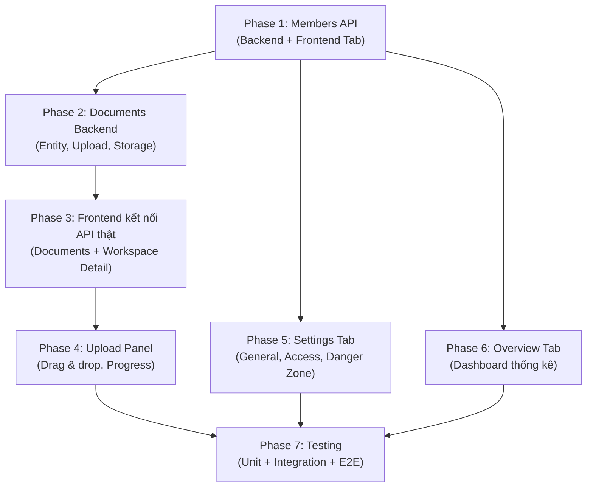

# Hoàn thiện Module Workspace — Kế hoạch triển khai

> Dựa trên phân tích [workspace-status-report.md](file:///d:/DoAnTotNghiep/unichat/workspace-status-report.md), đối chiếu `api-contracts.md §3-§4`, `data-model.md §2`, `file-plan.md §4-§7`.

## Hiện trạng

| Metric | Giá trị |
|---|---|
| Backend endpoints | **5/13** (38%) — chỉ workspace CRUD |
| Thiếu backend | **8 endpoints** — Members (4) + Documents (4) |
| Frontend tabs hoạt động | **2/5** — List + Documents (mock) |
| Frontend tabs placeholder | **3/5** — Tổng quan, Thành viên, Cài đặt |

## User Review Required

> [!IMPORTANT]
> Kế hoạch chia thành **7 phase** theo thứ tự dependency. Mỗi phase có thể commit và test độc lập. Bạn có thể chọn triển khai từng phase một hoặc nhóm phase.

> [!WARNING]
> Phase 2 (Documents Backend) yêu cầu RabbitMQ cho ingestion queue và file storage. Trong giai đoạn development, sẽ dùng **LocalStorageAdapter** (lưu file vào thư mục local) và **tạm bỏ qua RabbitMQ worker** — chỉ tạo entity + job record. Worker sẽ triển khai khi AI Service sẵn sàng.

## Open Questions

> [!IMPORTANT]
> 1. **Members invite flow**: Mời thành viên bằng email hay bằng userId? Spec ghi OWNER mời, nhưng cần xác nhận: người được mời tự động thành ACTIVE hay cần accept?
> 2. **Documents upload storage**: Dùng local filesystem (`./uploads/`) hay có kế hoạch dùng cloud storage (S3/GCS) sớm?
> 3. **Phase nào nên triển khai trước?** Recommend Phase 1 (Members) vì backend đã có entity/repo sẵn, chỉ thiếu Controller.

---

## Phase 1: Members API Backend + Frontend Tab Thành viên 🔴

### Backend — Members API

Dựa trên `api-contracts.md §3`. Entity `WorkspaceMember` và `WorkspaceMemberRepository` **đã có sẵn**.

#### [NEW] [MemberController.java](file:///d:/DoAnTotNghiep/unichat/core-api/src/main/java/com/unichat/core/workspace/api/MemberController.java)

REST controller cho 4 endpoints:

```
GET    /api/v1/workspaces/{workspaceId}/members        → Danh sách thành viên (OWNER only)
POST   /api/v1/workspaces/{workspaceId}/members        → Mời thành viên (OWNER only)
PATCH  /api/v1/workspaces/{workspaceId}/members/{userId} → Đổi role (OWNER only)
DELETE /api/v1/workspaces/{workspaceId}/members/{userId} → Xóa thành viên (OWNER only)
```

- Inject `MemberService` + `IdempotencyService`
- Dùng `@AuthenticationPrincipal Jwt` để lấy userId
- Validate input với Jakarta Validation

#### [NEW] [MemberService.java](file:///d:/DoAnTotNghiep/unichat/core-api/src/main/java/com/unichat/core/workspace/service/MemberService.java)

Business logic:

- **getMembers**: Query `WorkspaceMemberRepository.findByWorkspaceIdAndStatus(ACTIVE)`, join User entity để lấy email/displayName
- **inviteMember**: Tìm user bằng email → tạo `WorkspaceMember(VIEWER, ACTIVE)` → increment `permissionVersion`
- **changeRole**: Không cho phép đổi role OWNER → validate → update role
- **removeMember**: Không cho phép xóa OWNER → set status = REVOKED → increment `permissionVersion`

Guards:
- Caller phải là OWNER (kiểm tra qua `WorkspaceMemberRepository`)
- Không tự mời chính mình, không tự xóa chính mình
- Không đổi role OWNER thành role khác

#### [NEW] [MemberResponse.java](file:///d:/DoAnTotNghiep/unichat/core-api/src/main/java/com/unichat/core/workspace/api/MemberResponse.java)

```java
public record MemberResponse(
    UUID userId,
    String email,
    String displayName,
    WorkspaceRole role,
    WorkspaceMemberStatus status,
    UUID invitedById
) {}
```

#### [NEW] [InviteMemberRequest.java](file:///d:/DoAnTotNghiep/unichat/core-api/src/main/java/com/unichat/core/workspace/api/InviteMemberRequest.java)

```java
public record InviteMemberRequest(
    @NotBlank @Email String email,
    @NotNull WorkspaceRole role  // chỉ EDITOR hoặc VIEWER
) {}
```

#### [NEW] [UpdateMemberRoleRequest.java](file:///d:/DoAnTotNghiep/unichat/core-api/src/main/java/com/unichat/core/workspace/api/UpdateMemberRoleRequest.java)

```java
public record UpdateMemberRoleRequest(
    @NotNull WorkspaceRole role
) {}
```

#### [MODIFY] [WorkspaceMemberRepository.java](file:///d:/DoAnTotNghiep/unichat/core-api/src/main/java/com/unichat/core/workspace/domain/WorkspaceMemberRepository.java)

Thêm JPQL query join User entity để lấy thông tin hiển thị:

```java
@Query("SELECT m FROM WorkspaceMember m WHERE m.workspaceId = :workspaceId AND m.status = :status")
List<WorkspaceMember> findByWorkspaceIdAndStatus(UUID workspaceId, WorkspaceMemberStatus status);
```
(Query này đã có, chỉ cần thêm method tìm user kèm email nếu cần.)

---

### Frontend — Tab Thành viên

Theo `file-plan.md §4`: `features/members/`

#### [NEW] `frontend/src/features/members/member-schema.ts`

Types cho member data:

```typescript
export interface MemberDto {
  readonly userId: string;
  readonly email: string;
  readonly displayName: string | null;
  readonly role: 'OWNER' | 'EDITOR' | 'VIEWER';
  readonly status: 'ACTIVE' | 'REVOKED';
}
```

#### [NEW] `frontend/src/features/members/member-api.ts`

API client functions:
- `getMembers(workspaceId)` → `GET /workspaces/{id}/members`
- `inviteMember(workspaceId, data)` → `POST /workspaces/{id}/members`
- `updateMemberRole(workspaceId, userId, role)` → `PATCH /workspaces/{id}/members/{userId}`
- `removeMember(workspaceId, userId)` → `DELETE /workspaces/{id}/members/{userId}`

#### [NEW] `frontend/src/features/members/member-hooks.ts`

TanStack Query hooks:
- `useMembers(workspaceId)` — query
- `useInviteMember(workspaceId)` — mutation + invalidate
- `useUpdateMemberRole(workspaceId)` — mutation + invalidate
- `useRemoveMember(workspaceId)` — mutation + invalidate

#### [NEW] `frontend/src/features/members/member-table.tsx`

Bảng hiển thị thành viên:
- Columns: Avatar/Email, Role (badge), Actions (đổi role / xóa)
- Empty state khi chưa có thành viên
- Skeleton loader

#### [NEW] `frontend/src/features/members/invite-form.tsx`

Modal mời thành viên:
- Input email + select role (EDITOR/VIEWER)
- Zod validation
- Error handling (user not found, already member)

#### [NEW] `frontend/src/features/members/member-table.css`

Styling cho member table và invite form.

#### [MODIFY] [workspace-detail-page.tsx](file:///d:/DoAnTotNghiep/unichat/frontend/src/features/workspaces/workspace-detail-page.tsx)

- Thay `TabPlaceholder` cho tab `members` bằng `<MembersTab />` component thật
- Import `MemberTable` từ `features/members/`

---

## Phase 2: Documents Backend 🔴

### Backend — Document Module

Dựa trên `api-contracts.md §4` và `data-model.md §2`. Bảng `documents` và `resource_jobs` **đã có trong V1 migration**.

#### [NEW] `core-api/src/main/java/com/unichat/core/document/domain/Document.java`

JPA entity map bảng `documents`:
- Fields: id, workspaceId, storageKey, originalName, mediaType, byteSize, sha256, status, ingestionVersion, pageOrBlockCount, version, createdAt, updatedAt
- Status enum: PENDING, PROCESSING, PROCESSED, FAILED, DELETING

#### [NEW] `core-api/src/main/java/com/unichat/core/document/domain/DocumentStatus.java`

```java
public enum DocumentStatus {
    PENDING, PROCESSING, PROCESSED, FAILED, DELETING
}
```

#### [NEW] `core-api/src/main/java/com/unichat/core/document/domain/DocumentRepository.java`

```java
public interface DocumentRepository extends JpaRepository<Document, UUID> {
    Page<Document> findByWorkspaceIdAndStatusNot(UUID workspaceId, DocumentStatus status, Pageable pageable);
    long countByWorkspaceIdAndStatusNot(UUID workspaceId, DocumentStatus status);
    Optional<Document> findByIdAndWorkspaceId(UUID id, UUID workspaceId);
}
```

#### [NEW] `core-api/src/main/java/com/unichat/core/document/api/DocumentController.java`

5 endpoints theo spec:

```
GET    /api/v1/workspaces/{workspaceId}/documents             → Danh sách (ACL READ)
POST   /api/v1/workspaces/{workspaceId}/documents             → Upload (OWNER/EDITOR, multipart)
GET    /api/v1/workspaces/{workspaceId}/documents/{documentId} → Metadata (ACL READ)
DELETE /api/v1/workspaces/{workspaceId}/documents/{documentId} → Xóa async (OWNER)
GET    /api/v1/workspaces/{workspaceId}/documents/{documentId}/jobs → Trạng thái ingestion (OWNER/EDITOR)
```

#### [NEW] `core-api/src/main/java/com/unichat/core/document/service/DocumentService.java`

Business logic:
- **listDocuments**: Paginated query, exclude DELETING
- **uploadDocument**: Validate file → save to storage → create Document entity PENDING → create ResourceJob INGEST → return 202
- **getDocument**: ACL check + return metadata
- **deleteDocument**: OWNER check → set status DELETING → create ResourceJob DELETE
- **getJobs**: Query resource_jobs by documentId

#### [NEW] `core-api/src/main/java/com/unichat/core/document/service/UploadValidator.java`

Validation rules từ spec:
- Max 20 MiB/file
- PDF max 500 pages
- DOCX max 2000 logical blocks
- TXT phải UTF-8
- Max 100 documents/workspace
- Max 1 GiB/workspace (tổng byte_size)

#### [NEW] `core-api/src/main/java/com/unichat/core/document/api/DocumentResponse.java`

Response DTO cho document metadata.

#### [NEW] `core-api/src/main/java/com/unichat/core/document/api/DocumentUploadResponse.java`

Response 202 cho upload: `{ documentId, jobId, status: "PENDING" }`

#### [NEW] `core-api/src/main/java/com/unichat/core/storage/StoragePort.java`

Interface cho file storage:

```java
public interface StoragePort {
    StoredFile store(UUID workspaceId, String originalName, InputStream content, long size);
    InputStream retrieve(String storageKey);
    void delete(String storageKey);
}
```

#### [NEW] `core-api/src/main/java/com/unichat/core/storage/LocalStorageAdapter.java`

Local filesystem implementation cho development. Lưu file vào `./uploads/{workspaceId}/{uuid}-{originalName}`.

#### [NEW] `core-api/src/main/java/com/unichat/core/storage/StoredFile.java`

Record chứa storageKey + sha256 hash.

#### [NEW] `core-api/src/main/java/com/unichat/core/document/domain/ResourceJob.java`

JPA entity map bảng `resource_jobs` (đã có trong V1 migration).

#### [NEW] `core-api/src/main/java/com/unichat/core/document/domain/ResourceJobRepository.java`

Repository cho resource jobs.

#### [MODIFY] [WorkspaceService.java](file:///d:/DoAnTotNghiep/unichat/core-api/src/main/java/com/unichat/core/workspace/service/WorkspaceService.java)

- Inject `DocumentRepository` để `toResponse()` trả `documentCount` thật thay vì hardcode `0`

---

## Phase 3: Frontend kết nối API thật 🟡

### Workspace Detail — API thật

#### [MODIFY] [workspace-api.ts](file:///d:/DoAnTotNghiep/unichat/frontend/src/features/workspaces/workspace-api.ts)

Thêm function:

```typescript
export function getWorkspace(workspaceId: string): Promise<WorkspaceDto> {
  return fetchJson(`/workspaces/${workspaceId}`);
}

export function updateWorkspace(workspaceId: string, data: UpdateWorkspaceInput): Promise<WorkspaceDto> {
  return fetchJson(`/workspaces/${workspaceId}`, {
    method: 'PATCH',
    body: JSON.stringify(data),
  });
}
```

#### [MODIFY] [workspace-hooks.ts](file:///d:/DoAnTotNghiep/unichat/frontend/src/features/workspaces/workspace-hooks.ts)

Thêm hooks:
- `useWorkspace(workspaceId)` — fetch single workspace
- `useUpdateWorkspace(workspaceId)` — mutation

#### [MODIFY] [workspace-schema.ts](file:///d:/DoAnTotNghiep/unichat/frontend/src/features/workspaces/workspace-schema.ts)

Thêm `UpdateWorkspaceInput` type + Zod schema.

#### [MODIFY] [workspace-detail-page.tsx](file:///d:/DoAnTotNghiep/unichat/frontend/src/features/workspaces/workspace-detail-page.tsx)

- `WorkspaceHeader` gọi `useWorkspace(workspaceId)` thay vì hardcode
- Hiển thị tên, mô tả, visibility badge từ API data
- Loading/error states

#### [MODIFY] [document-api.ts](file:///d:/DoAnTotNghiep/unichat/frontend/src/features/documents/document-api.ts)

Thay mock data bằng `fetchJson` calls thật:

```typescript
export function getDocuments(workspaceId: string): Promise<PagedResponse<DocumentDto>> {
  return fetchJson(`/workspaces/${workspaceId}/documents`);
}

export function deleteDocument(workspaceId: string, documentId: string): Promise<void> {
  return fetchJson(`/workspaces/${workspaceId}/documents/${documentId}`, { method: 'DELETE' });
}
```

---

## Phase 4: Upload Panel 🟡

#### [NEW] `frontend/src/features/documents/upload-panel.tsx`

Component upload tài liệu:
- **Drag & drop zone** với visual feedback
- **File picker** button fallback
- **File validation** client-side (type, size 20MiB)
- **Progress bar** per file (sử dụng XMLHttpRequest hoặc fetch with ReadableStream)
- **Status indicators**: uploading → pending → processing
- **Multi-file upload** support
- Gọi `POST /workspaces/{workspaceId}/documents` (multipart/form-data)

#### [NEW] `frontend/src/features/documents/upload-panel.css`

Styling: drag zone, progress bars, file list.

#### [NEW] `frontend/src/features/documents/upload-schema.ts` (update)

Zod validation cho upload constraints client-side.

#### [MODIFY] [workspace-detail-page.tsx](file:///d:/DoAnTotNghiep/unichat/frontend/src/features/workspaces/workspace-detail-page.tsx)

- Kết nối button "Upload tài liệu" trong header với UploadPanel
- Hiển thị UploadPanel trong Documents tab

---

## Phase 5: Settings Tab 🟢

#### [NEW] `frontend/src/features/settings/workspace-settings.tsx`

Container component cho settings:
- **General section**: Sửa tên, mô tả workspace (gọi `PATCH /workspaces/{id}`)
- **Access section**: Đổi visibility (PRIVATE/SHARED/PUBLIC)
- **Danger zone**: Xóa workspace (confirm modal, gọi `DELETE /workspaces/{id}`)

#### [NEW] `frontend/src/features/settings/general-form.tsx`

Form sửa tên + mô tả:
- Pre-fill từ workspace data
- Zod validation (name 3-100 chars, description max 1000)
- Gửi `expectedVersion` cho optimistic locking

#### [NEW] `frontend/src/features/settings/access-form.tsx`

Form đổi visibility:
- Radio buttons: Riêng tư / Chia sẻ / Công khai
- Cảnh báo khi chuyển từ PUBLIC → PRIVATE

#### [NEW] `frontend/src/features/settings/danger-zone.tsx`

Danger zone:
- Red border section
- "Xóa workspace" button
- Confirm modal: nhập tên workspace để xác nhận
- Navigate về `/workspaces` sau khi xóa

#### [NEW] `frontend/src/features/settings/settings.css`

Styling cho settings page sections.

#### [MODIFY] [workspace-detail-page.tsx](file:///d:/DoAnTotNghiep/unichat/frontend/src/features/workspaces/workspace-detail-page.tsx)

- Thay `TabPlaceholder` cho tab `settings` bằng `<SettingsTab />`

---

## Phase 6: Overview Tab 🟢

#### [NEW] `frontend/src/features/workspaces/components/overview-tab.tsx`

Dashboard thống kê workspace:
- **Stat cards**: Số tài liệu, số thành viên, số cuộc trò chuyện
- **Mô tả workspace** hiển thị
- **Thông tin workspace**: ngày tạo, chủ sở hữu, visibility
- **Hoạt động gần đây** (optional — có thể để sau)

Dữ liệu lấy từ `useWorkspace(workspaceId)` — response đã có `documentCount`, `memberCount`.

#### [NEW] `frontend/src/features/workspaces/components/overview-tab.css`

Styling cho stat cards, layout grid.

#### [MODIFY] [workspace-detail-page.tsx](file:///d:/DoAnTotNghiep/unichat/frontend/src/features/workspaces/workspace-detail-page.tsx)

- Thay `TabPlaceholder` cho tab `overview` bằng `<OverviewTab />`

---

## Phase 7: Testing 🟡

### Backend Tests

#### [NEW] `core-api/src/test/java/com/unichat/core/workspace/service/MemberServiceTest.java`

Unit tests cho MemberService:
- Invite thành viên thành công
- Invite user không tồn tại → error
- Invite user đã là member → conflict
- Đổi role thành công
- Không cho đổi role OWNER
- Xóa thành viên thành công
- Không cho xóa OWNER

#### [NEW] `core-api/src/test/java/com/unichat/core/document/service/DocumentServiceTest.java`

Unit tests cho DocumentService:
- Upload thành công → return 202
- Upload vượt 20MiB → rejected
- Upload vượt 100 docs/workspace → rejected
- Delete document → status DELETING
- List documents → exclude DELETING

#### [NEW] `core-api/src/test/java/com/unichat/core/workspace/api/MemberControllerTest.java`

Integration tests (MockMvc):
- GET members → 200 + list
- POST member → 201 + member response
- PATCH member role → 200
- DELETE member → 204
- Non-OWNER → 403

#### [NEW] `core-api/src/test/java/com/unichat/core/document/api/DocumentControllerTest.java`

Integration tests (MockMvc):
- GET documents → 200 + paginated list
- POST upload → 202
- GET document → 200 + metadata
- DELETE document → 202
- GET jobs → 200

### Frontend Tests

#### [NEW] `frontend/src/features/members/__tests__/member-hooks.test.ts`
#### [NEW] `frontend/src/features/documents/__tests__/document-hooks.test.ts`

### E2E Tests (Playwright)

#### [NEW] `frontend/e2e/workspace-members.spec.ts`

- Mời thành viên → hiển thị trong bảng
- Đổi role → badge cập nhật
- Xóa thành viên → biến mất khỏi bảng

#### [NEW] `frontend/e2e/workspace-documents.spec.ts`

- Upload file → hiển thị trong document table
- Xóa document → confirm → biến mất

---

## Thứ tự thực hiện tổng quan



| Phase | Effort | Dependencies |
|---|---|---|
| 1 — Members API + Tab | 🔴 Lớn | Không — entity/repo đã sẵn |
| 2 — Documents Backend | 🔴 Lớn | Không — DB tables đã có |
| 3 — Frontend kết nối API | 🟡 TB | Phase 1 + 2 backend sẵn sàng |
| 4 — Upload Panel | 🟡 TB | Phase 2 (POST /documents) |
| 5 — Settings Tab | 🟢 Nhỏ | Phase 1 (workspace hooks) |
| 6 — Overview Tab | 🟢 Nhỏ | Phase 1 (workspace hooks) |
| 7 — Testing | 🟡 TB | Tất cả phases trước |

## Verification Plan

### Automated Tests
- Chạy `mvn test` sau mỗi phase backend
- Chạy `npm test` sau mỗi phase frontend
- Chạy `npx playwright test` cho E2E ở Phase 7

### Manual Verification
- Kiểm tra API endpoints bằng cURL/Postman sau Phase 1, 2
- Kiểm tra UI trên browser sau Phase 3, 4, 5, 6
- Verify workspace detail page hiển thị data thật từ API
