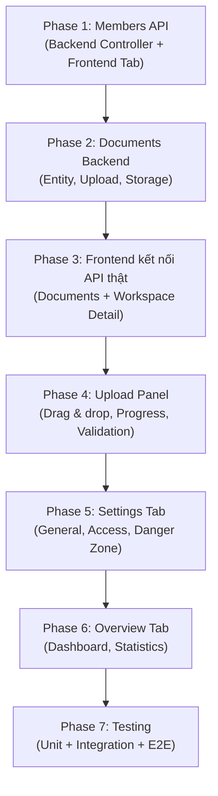

# Phân tích hiện trạng: Không gian làm việc (Workspace)

> Đối chiếu với: `api-contracts.md` §3-§4, `data-model.md` §2, `file-plan.md` §4-§7

---

## 1. Đã triển khai ✅

### Backend (Core API — Spring Boot)

| Thành phần | File | Trạng thái |
|---|---|---|
| Entity `Workspace` | `workspace/domain/Workspace.java` | ✅ Đầy đủ |
| Entity `WorkspaceMember` | `workspace/domain/WorkspaceMember.java` | ✅ Đầy đủ |
| Enums (Role, Status, Visibility) | `domain/WorkspaceRole.java` etc. | ✅ OWNER/EDITOR/VIEWER, ACTIVE/REVOKED, PRIVATE/SHARED/PUBLIC |
| Repository + custom query | `WorkspaceRepository.java` | ✅ `findAllVisibleToUser` (owned/member/public) |
| Member repository | `WorkspaceMemberRepository.java` | ✅ find/count by status |
| **GET** `/workspaces` | `WorkspaceController` | ✅ Paginated, ACL-aware |
| **POST** `/workspaces` | `WorkspaceController` | ✅ Idempotency-Key support |
| **GET** `/workspaces/{id}` | `WorkspaceController` | ✅ ACL check (public bypass) |
| **PATCH** `/workspaces/{id}` | `WorkspaceController` | ✅ Optimistic locking, role-based field access |
| **DELETE** `/workspaces/{id}` | `WorkspaceController` | ✅ OWNER only, soft delete |
| DTOs | `CreateWorkspaceRequest`, `UpdateWorkspaceRequest`, `WorkspaceResponse` | ✅ Jakarta Validation |
| Unit test | `WorkspaceServiceTest.java` | ✅ Có |

### Frontend (React — Vite)

| Thành phần | File | Trạng thái |
|---|---|---|
| Workspace list page | `workspace-list-page.tsx` | ✅ Search + visibility filter |
| Workspace card | `workspace-card.tsx` | ✅ Badge, stats, link to detail |
| Create workspace form | `workspace-form.tsx` | ✅ Modal với Zod validation |
| Skeleton loader | `skeleton-card.tsx` | ✅ Loading state |
| API client | `workspace-api.ts` | ✅ getWorkspaces, createWorkspace, deleteWorkspace |
| Hooks | `workspace-hooks.ts` | ✅ useWorkspaces, useCreateWorkspace, useDeleteWorkspace |
| Schema/types | `workspace-schema.ts` | ✅ WorkspaceDto, PagedResponse, Zod schema |
| **Workspace detail page** | `workspace-detail-page.tsx` | ✅ Header + 5 tabs + documents tab |
| **Document table** | `document-table.tsx` | ✅ Search + type filter + status badges + actions (mock data) |
| Route | `app-router.tsx` | ✅ `/workspaces` + `/workspaces/:workspaceId` |

---

## 2. Chưa triển khai ❌ — Cần bổ sung

### 2.1 Backend — Members API (api-contracts.md §3)

> [!IMPORTANT]
> Đây là phần thiếu lớn nhất. Backend có entity/repository nhưng **chưa có Controller** cho members.

| API | Route | Quyền | Trạng thái |
|---|---|---|---|
| **GET** | `/workspaces/{id}/members` | OWNER | ❌ Chưa có Controller |
| **POST** | `/workspaces/{id}/members` | OWNER | ❌ Mời thành viên |
| **PATCH** | `/workspaces/{id}/members/{userId}` | OWNER | ❌ Đổi role |
| **DELETE** | `/workspaces/{id}/members/{userId}` | OWNER | ❌ Xóa thành viên |

**Cần tạo:**
- `MemberController.java` — REST endpoints
- `MemberService.java` — Business logic (invite, change role, remove)
- `MemberResponse.java` — DTO trả về (userId, email, displayName, role, status)
- `InviteMemberRequest.java` — DTO nhận vào

---

### 2.2 Backend — Documents API (api-contracts.md §4)

> [!IMPORTANT]
> Backend hoàn toàn chưa có module `document/`. Đây là prerequisite cho tab Tài liệu.

| API | Route | Quyền | Trạng thái |
|---|---|---|---|
| **GET** | `/workspaces/{id}/documents` | ACL READ | ❌ |
| **POST** | `/workspaces/{id}/documents` | OWNER/EDITOR | ❌ Upload file |
| **GET** | `/workspaces/{id}/documents/{docId}` | ACL READ | ❌ Metadata |
| **DELETE** | `/workspaces/{id}/documents/{docId}` | OWNER | ❌ Async delete saga |
| **GET** | `/workspaces/{id}/documents/{docId}/jobs` | OWNER/EDITOR | ❌ Ingestion status |

**Cần tạo:**
- `Document.java` entity (id, workspaceId, storageKey, originalName, mediaType, byteSize, sha256, status)
- `DocumentRepository.java`
- `DocumentController.java`
- `DocumentService.java` + `UploadValidator.java` (20MiB, 500 pages PDF, 100 docs/workspace)
- `StoragePort.java` + `LocalStorageAdapter.java` (file storage)
- `ResourceJob.java` entity + worker (ingestion queue via RabbitMQ)
- DB migration: `V4__create_documents_table.sql`, `V5__create_resource_jobs_table.sql`

---

### 2.3 Frontend — Workspace Detail kết nối API thật

| Thành phần | Trạng thái | Cần làm |
|---|---|---|
| Header dùng tên workspace thật | ❌ Mock cứng | Gọi `getWorkspace(id)` API |
| `workspace-api.ts` thiếu `getWorkspace(id)` | ❌ | Thêm hàm + hook |
| Document API kết nối backend | ❌ Mock data | Thay mock bằng `fetchJson` khi backend sẵn sàng |
| Upload panel (drag & drop, progress) | ❌ Placeholder | Feature `upload-panel.tsx` |

---

### 2.4 Frontend — Tab Thành viên

Theo `file-plan.md` §4: `features/members/`

| File cần tạo | Mục đích |
|---|---|
| `member-api.ts` | GET/POST/PATCH/DELETE members |
| `member-table.tsx` | Bảng thành viên (email, role, actions) |
| `role-form.tsx` | Modal mời thành viên / đổi role |

---

### 2.5 Frontend — Tab Cài đặt

Theo `file-plan.md` §4: `features/settings/`

| File cần tạo | Mục đích |
|---|---|
| `settings-page.tsx` (workspace-level) | Container cho settings tabs |
| `general-form.tsx` | Sửa tên, mô tả workspace |
| `access-form.tsx` | Đổi visibility (PRIVATE/SHARED/PUBLIC) |
| `danger-zone.tsx` | Xóa workspace (confirm modal) |

---

### 2.6 Frontend — Tab Tổng quan

| Cần triển khai | Mô tả |
|---|---|
| Dashboard tổng quan workspace | Thống kê: số tài liệu, thành viên, conversations |
| Activity feed (optional) | Lịch sử hoạt động gần đây |

---

### 2.7 Testing

| Layer | Hiện tại | Cần bổ sung |
|---|---|---|
| Backend `WorkspaceServiceTest` | ✅ Có | Thêm test cho member/document operations |
| Backend integration test | ❌ | Controller test với MockMvc |
| Frontend unit test | ❌ | Test cho hooks, components |
| E2E (Playwright) | ❌ | `document-chat.spec.ts`, `permissions.spec.ts` |

---

## 3. Roadmap đề xuất (theo thứ tự ưu tiên)

| Phase | Mô tả | Effort |
|---|---|---|
| **1** | Members API backend + Frontend tab Thành viên | 🔴 Lớn |
| **2** | Documents backend (entity, upload, storage, ingestion) | 🔴 Lớn |
| **3** | Kết nối frontend với API thật (documents + workspace detail) | 🟡 Trung bình |
| **4** | Upload panel (drag & drop, progress bar, validation) | 🟡 Trung bình |
| **5** | Settings tab (general, access, danger zone) | 🟢 Nhỏ |
| **6** | Overview tab (dashboard thống kê) | 🟢 Nhỏ |
| **7** | Unit test, integration test, E2E | 🟡 Trung bình |

---

## 4. Tóm tắt nhanh

| Metric | Giá trị |
|---|---|
| Tổng API trong spec (§3+§4) | **13 endpoints** |
| Đã implement backend | **5/13** (38%) — chỉ workspace CRUD |
| Chưa implement backend | **8/13** — members (4) + documents (4) |
| Frontend pages | **2/5 tabs** hoạt động (List + Documents mock) |
| Frontend tabs placeholder | **3/5** (Tổng quan, Thành viên, Cài đặt) |
